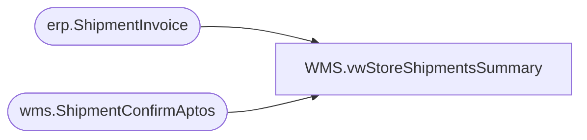

# WMS.vwStoreShipmentsSummary

**Database:** IntegrationStaging  
**Server:** STL-SSIS-P-01  

## Architecture Diagram



## Table Dependencies

| Referenced Table |
|---|
| erp.ShipmentInvoice |
| wms.ShipmentConfirmAptos |

## View Code

```sql
CREATE view [WMS].[vwStoreShipmentsSummary]

as
--------------------------------------------------------------------------------------------------------------------------
--	Ian Wallace	- 2022-12-12	
--------------------------------------------------------------------------------------------------------------------------


-- 3PL shipped yesterday 
		  select top 3 OrderRef as 'TO_SO Number', ItemId as 'Item Number', InventLocationId as 'FromLocation', ShipTo as 'ToLocation', cast(ShipDate as date) as 'Ship Date', 0 as DaysOutstanding, sum(WhseUnitQty) as UnitsSent 
		  --select * 
		  from [stl-ssis-p-01].IntegrationStaging.erp.ShipmentInvoice 
		  where 1=1
		  --and  OrderRef = 'TO0000028174'
		  group by OrderRef, ItemId, InventLocationId, ShipTo, ShipDate
		  --and cast(ShipDate as date) = cast(getdate()-3 as date)
		  --order by  cast(ShipDate as date) asc

		 -- select * from [stl-ssis-p-01].IntegrationStaging.erp.ShipmentInvoice where  OrderRef = 'TO0000028174'
		 -- select * from [stl-ssis-p-01].IntegrationStaging.erp.ShipmentInvoice where cast(ShipDate as date) = cast(getdate()-2 as date) and  OrderRef = 'TO0000028174'
		 -- select * from [stl-ssis-p-01].IntegrationStaging.erp.ShipmentInvoice where cast(ShipDate as date) = cast(getdate()-2 as date) and  OrderRef = 'TO0000028531'

		 union

-- 980 shipped yesterday 
		select top 3 OrderNumber as 'TO_SO Number', ItemNumber as 'Item Number', Warehouse as 'FromLocation', ToLocation as 'ToLocation', cast(ShipConfirmDateTime as date) as 'Ship Date', 0 as DaysOutstanding, sum(ShippedQuantity) as UnitsSent 
		--select *
		from [stl-ssis-p-01].IntegrationStaging.wms.ShipmentConfirmAptos 
		where 1=1
		and cast(ShipConfirmDateTime as date) >= cast(getdate()-7 as date) 
		--and OrderNumber = 'TO0000190964'
		group by OrderNumber, ItemNumber, Warehouse, ToLocation, ShipCOnfirmDateTime
		--order by cast(ShipConfirmDateTime as date), OrderNumber, ItemNumber asc
```

