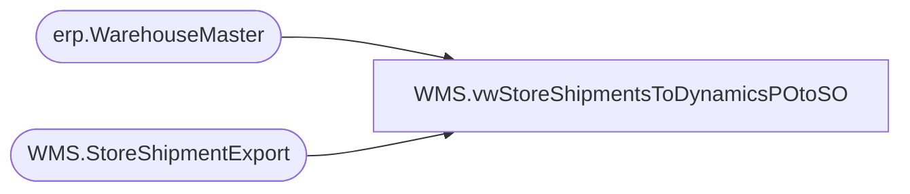

# WMS.vwStoreShipmentsToDynamicsPOtoSO

**Database:** IntegrationStaging  
**Server:** STL-SSIS-P-01  

## Architecture Diagram



## Table Dependencies

| Referenced Table |
|---|
| erp.WarehouseMaster |
| WMS.StoreShipmentExport |

## View Code

```sql
CREATE view [WMS].[vwStoreShipmentsToDynamicsPOtoSO]

as
--------------------------------------------------------------------------------------------------------------------------
--	Dan Tweedie	- 2019-08-02	Used in SSIS as data source to push staged distros to Dynamics WMS for non-US locations. 
--	Lizzy Timm	2025-01-09	Added new bonded CN warehouse for Italy - 9942
--------------------------------------------------------------------------------------------------------------------------

select 
	case 
		when sse.DestinationCountry='US' and sse.ToWarehouse NOT IN ('9941','9942') then '1100' 
		when sse.DestinationCountry='CA' then '1700'
		when sse.DestinationCountry='UK' then '2110'
		when sse.DestinationCountry='CN' and sse.ToWarehouse NOT IN ('9941','9942') then '3001'
		when sse.ToWarehouse IN ('9941','9942') then '1200'
	end as Entity,
	cast(case 
			when sse.SourceCountry='US' and sse.DestinationCountry='CA' 
				then 'CUST000058'
			when sse.SourceCountry='US' and sse.DestinationCountry='UK'
				then 'CUST000022'
			when sse.SourceCountry='US' and sse.DestinationCountry='CN'
				then 'CUST000059'
			when sse.SourceCountry='UK' and sse.DestinationCountry='DK'
				then 'CUST000082'
			when sse.SourceCountry='UK' and sse.DestinationCountry='US'
				then 'CUST000060'
			when sse.SourceCountry='UK' and sse.DestinationCountry='CN'
				then 'CUST000059'
			when sse.SourceCountry='CN' and sse.DestinationCountry='UK'
				then 'CUST000024'
			when sse.SourceCountry='CN' and sse.DestinationCountry='US'
				then 'CUST000025'
		end 
		as varchar(10)
		) as CustomerAccountNumber,
	ToWarehouse as StoreDepartment,
	--'None' as deliveryType,
	'Direct' as deliveryType,
	convert(varchar(10), ShipDate,101) as ShipDate,
	convert(varchar(10), ReceiptDate,101) as ReceiptDate,
	AptosShipmentNumber as BABAptosShipmentNumber,
	--AptosShipmentNumber + '00'	as BABAptosShipmentNumber,
	DeliveryTerms,
	--case when left(ModeOfDelivery, 5)='FEDEX' then 'INTLFX' else ModeOfDelivery end as ModeOfDelivery,
	ModeOfDelivery,
	ToWarehouse,
	FromWarehouse,
	ItemNumber,	
	AptosDistroNumber as BABAptosDistroNumber,
	AptosDistroLineNumber as BABAptosDistroLineNumber,
	quantity,	
	UnitOfMeasure as UOM,	
	InventoryStatus,
	case
		when sse.SourceCountry='US' then '99001'
		when sse.SourceCountry='UK' then '99004'
		when sse.SourceCountry='CN' then '99999'
	end as OrderVendorAccountNumber
from WMS.StoreShipmentExport sse
join erp.WarehouseMaster wm on sse.ToWarehouse=wm.WarehouseID
where 1=1
and OrderType='SalesOrder'
and ExportDate is NULL
--and datediff(dd, ExportDate, getdate()) = 0
```

