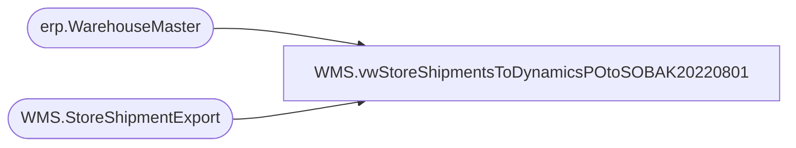

# WMS.vwStoreShipmentsToDynamicsPOtoSOBAK20220801

**Database:** IntegrationStaging  
**Server:** STL-SSIS-P-01  

## Architecture Diagram



## Table Dependencies

| Referenced Table |
|---|
| erp.WarehouseMaster |
| WMS.StoreShipmentExport |

## View Code

```sql
CREATE view [WMS].[vwStoreShipmentsToDynamicsPOtoSOBAK20220801]

as
--------------------------------------------------------------------------------------------------------------------------
--	Dan Tweedie	- 2019-08-02	Used in SSIS as data source to push staged distros to Dynamics WMS for non-US locations. 
--------------------------------------------------------------------------------------------------------------------------

select 
	cast('1100' as varchar(4)) as Entity,
	--cast('CUST000058' as varchar(10)) as CustomerAccountNumber,
	cast(case 
			when wm.Entity = 1700 then 'CUST000058'
			when wm.Entity = 2110 then 'CUST000022'
			when wm.Entity = 3001 then 'CUST000059'
			else 'CUST000058'
		 end 
		as varchar(10)
		) as CustomerAccountNumber,
	ToWarehouse as StoreDepartment,
	--'None' as deliveryType,
	'Direct' as deliveryType,
	convert(varchar(10), ShipDate,101) as ShipDate,
	convert(varchar(10), ReceiptDate,101) as ReceiptDate,
	AptosShipmentNumber as BABAptosShipmentNumber,
	--AptosShipmentNumber + '00'	as BABAptosShipmentNumber,
	DeliveryTerms,
	--case when left(ModeOfDelivery, 5)='FEDEX' then 'INTLFX' else ModeOfDelivery end as ModeOfDelivery,
	ModeOfDelivery,
	ToWarehouse,
	FromWarehouse,
	ItemNumber,	
	AptosDistroNumber as BABAptosDistroNumber,
	AptosDistroLineNumber as BABAptosDistroLineNumber,
	quantity,	
	UnitOfMeasure as UOM,	
	InventoryStatus
from WMS.StoreShipmentExport sse
join erp.WarehouseMaster wm on sse.ToWarehouse=wm.WarehouseID
where 1=1
--and CountryCode <> 'US'
and OrderType='SalesOrder'
and ExportDate is NULL
--and datediff(dd, ExportDate, getdate()) = 0
```

