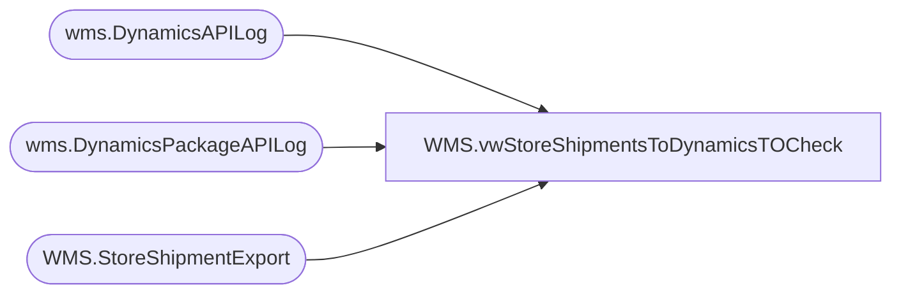

# WMS.vwStoreShipmentsToDynamicsTOCheck

**Database:** IntegrationStaging  
**Server:** STL-SSIS-P-01  

## Architecture Diagram



## Table Dependencies

| Referenced Table |
|---|
| wms.DynamicsAPILog |
| wms.DynamicsPackageAPILog |
| WMS.StoreShipmentExport |

## View Code

```sql
CREATE view [WMS].[vwStoreShipmentsToDynamicsTOCheck]

as 

WITH Shipments AS (
       SELECT CONCAT(AptosShipmentNumber, '-', CAST(TriggerDate AS date)) ID
       FROM IntegrationStaging.wms.DynamicsPackageAPILog with (nolock) 
       WHERE 1=1
              AND IntegrationName = 'WMS_TransferOrderCreateFromAptos' 
              AND CAST(TriggerDate AS date) >= CAST(DATEADD(day,-1,getdate()) AS date)
             -- AND LEN(AptosShipmentNumber) >= 19 -- Aptos store shipments = 10 digits while Girl Scout parties are 7 digits
       UNION
       SELECT CONCAT(StoreShipmentNumber, '-', CAST(InsertDate AS date)) ID
       FROM IntegrationStaging.wms.DynamicsAPILog with (nolock) 
       WHERE 1=1
              AND IntegrationName = 'WMS_TransferOrderCreateFromAptos' 
              AND CAST(InsertDate AS date) >= CAST(DATEADD(Day,-1,getdate()) AS date)
            --  AND LEN(StoreShipmentNumber) >= 10 -- Aptos store shipments = 10 digits while Girl Scout parties are 7 digits
)
SELECT DISTINCT sse.Company, sse.AptosShipmentNumber, sse.FromWarehouse, sse.ToWarehouse, sse.ModeOfDelivery, sse.ShipDate, sse.InsertDate, sse.UpdateDate, sse.ExportDate, COUNT(sse.AptosDistroNumber) DistroCount
  FROM WMS.StoreShipmentExport sse with(nolock)
  WHERE 1=1
       AND CONCAT(sse.AptosShipmentNumber,'-',CAST(sse.ExportDate AS Date))  NOT IN (SELECT DISTINCT ID FROM Shipments)
       AND CAST(sse.ExportDate AS Date) >= CAST(DATEADD(day,-1,getdate()) AS date)
            --  AND LEN(sse.AptosShipmentNumber) >= 10 -- Aptos store shipments = 10 digits while Girl Scout parties are 7 digits
  GROUP BY sse.Company, sse.AptosShipmentNumber, sse.FromWarehouse, sse.ToWarehouse, sse.ModeOfDelivery, sse.ShipDate, sse.InsertDate, sse.UpdateDate, sse.ExportDate
```

