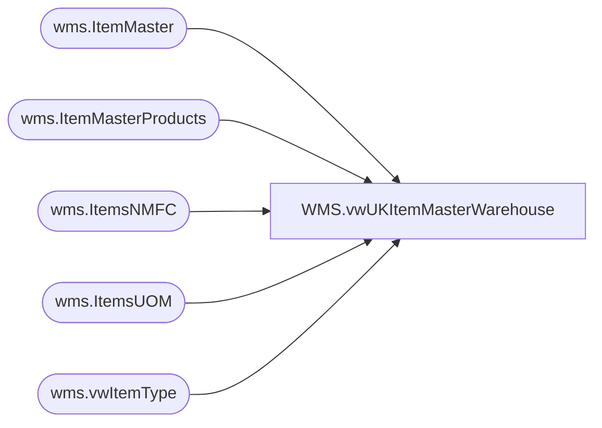

# WMS.vwUKItemMasterWarehouse

**Database:** IntegrationStaging  
**Server:** STL-SSIS-P-01  

## Architecture Diagram



## Table Dependencies

| Referenced Table |
|---|
| wms.ItemMaster |
| wms.ItemMasterProducts |
| wms.ItemsNMFC |
| wms.ItemsUOM |
| wms.vwItemType |

## View Code

```sql
CREATE view [WMS].[vwUKItemMasterWarehouse]

as 

with
UOMPivot as
(
    select
        ProductNumber,
       
        BAG,BALE,BDL,BX,CS,IP,KT,LB,PK,PLT,RL,ROLL,[SET]
    from
    (
        select
            ProductNumber,
           
            FromUnitSymbol,
            Factor as Qty
        from wms.ItemsUOM
        where Entity=1100
        and ToUnitSymbol='ea'
    ) as UOM
    PIVOT
    (
        sum(QTy)
        for FromUnitSymbol in ([BAG],[BALE],[BDL],[BX],[CS],[ip],[KT],[lb],[PK],[PLT],[RL],[Roll],[SET])
    ) as pt
)


select distinct p.ProductNumber, 
p.NMFCCode as nmfc_code,
n.LTLClass as frt_class, 
n.[name] as commodity_level_desc, 
p.ProductDescription as wm_sku_desc, 
u.ip as WM_STD_PACK_QTY, -- Do we need to account for null values
u.CS as WM_STD_CASE_QTY, -- Do we need to account for null values
p.HarmonizedSystemCode as WM_COMMODITY_CODE, 
i.ItemType as WM_STORE_DEPT,-- In MA-WMS this was  MER or SUP, is this a requirement? 
im.OriginCountryRegionID as WM_ORGN_CERT_CODE-- Ex: CN, US, null 

from wms.ItemMasterProducts p (nolock)
left join wms.vwItemType I (nolock) on i.ItemNumber=p.ProductNumber and i.Entity = '1100'
left join wms.ItemMaster IM (nolock) on p.ProductNumber=im.ProductNumber
left join UOMPivot u (nolock) on u.ProductNumber=p.ProductNumber
left join wms.ItemsNMFC n (nolock) on n.NMFCCode=p.NMFCCode
where p.Entity = '1100'
--order by 1
```

