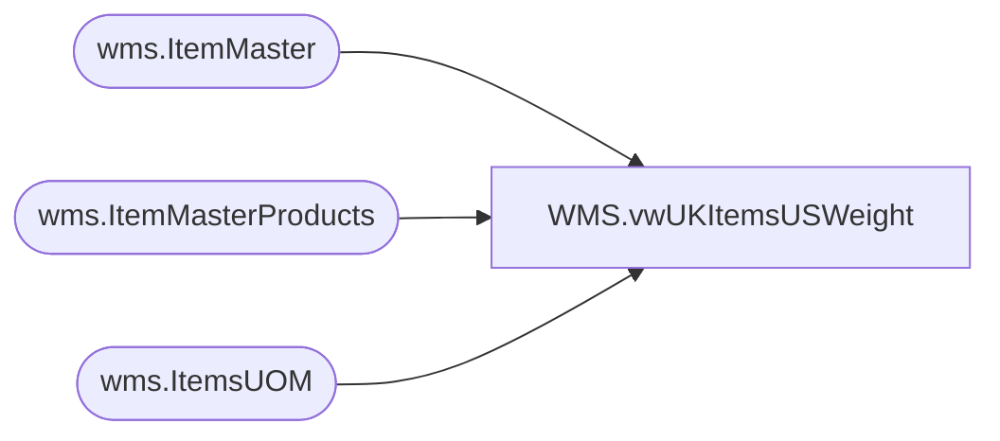

# WMS.vwUKItemsUSWeight

**Database:** IntegrationStaging  
**Server:** STL-SSIS-P-01  

## Architecture Diagram



## Table Dependencies

| Referenced Table |
|---|
| wms.ItemMaster |
| wms.ItemMasterProducts |
| wms.ItemsUOM |

## View Code

```sql
CREATE view [WMS].[vwUKItemsUSWeight] 

as

with 
UKItems as 
	(
		select 
			im.ProductNumber, 
			p.ProductDescription,
			im.NetProductWeight,
			im.InventoryUnitSymbol
		from wms.ItemMaster im with (nolock)
		join wms.ItemMasterProducts p with (nolock) on im.ProductNumber=p.ProductNumber
		where left(im.ProductNumber,1) in ('4','5','6') -- Changed from =4 on 1/5/2021
		and im.entity = 2110 -- UK 
	),
USItemWithWeight as
	(
		select 
			uk.ProductNumber, 
			im.NetProductWeight as WeightPound,
			(im.NetProductWeight * 0.453592) WeightKG,
			im.InventoryUnitSymbol,
			uom.Factor,
			uom.FromUnitSymbol,
			uom.ToUnitSymbol,
			im.UnitCost
		from wms.ItemMaster im with (nolock)
		join UKItems uk on right(im.ProductNumber,5)=right(uk.ProductNumber,5)
		join wms.ItemsUOM uom with (nolock) 
			on im.Entity=uom.Entity
			and im.ProductNumber=uom.ProductNumber
			and uom.ToUnitSymbol = 'wmea'
			and uom.FromUnitSymbol = im.InventoryUnitSymbol
		where im.entity = 1100 -- US
		and left(im.ProductNumber,1) = '0'
		and isnumeric(im.ProductNumber) =1
	)
select 
	uk.ProductNumber,
	uk.ProductDescription,
	us.WeightPound,
	us.WeightKG,
	us.InventoryUnitSymbol,
	us.FromUnitSymbol,
	us.ToUnitSymbol,
	us.Factor,
	us.UnitCost
from UKItems uk 
left join USItemWithWeight us 
	on uk.ProductNumber=us.ProductNumber
```

