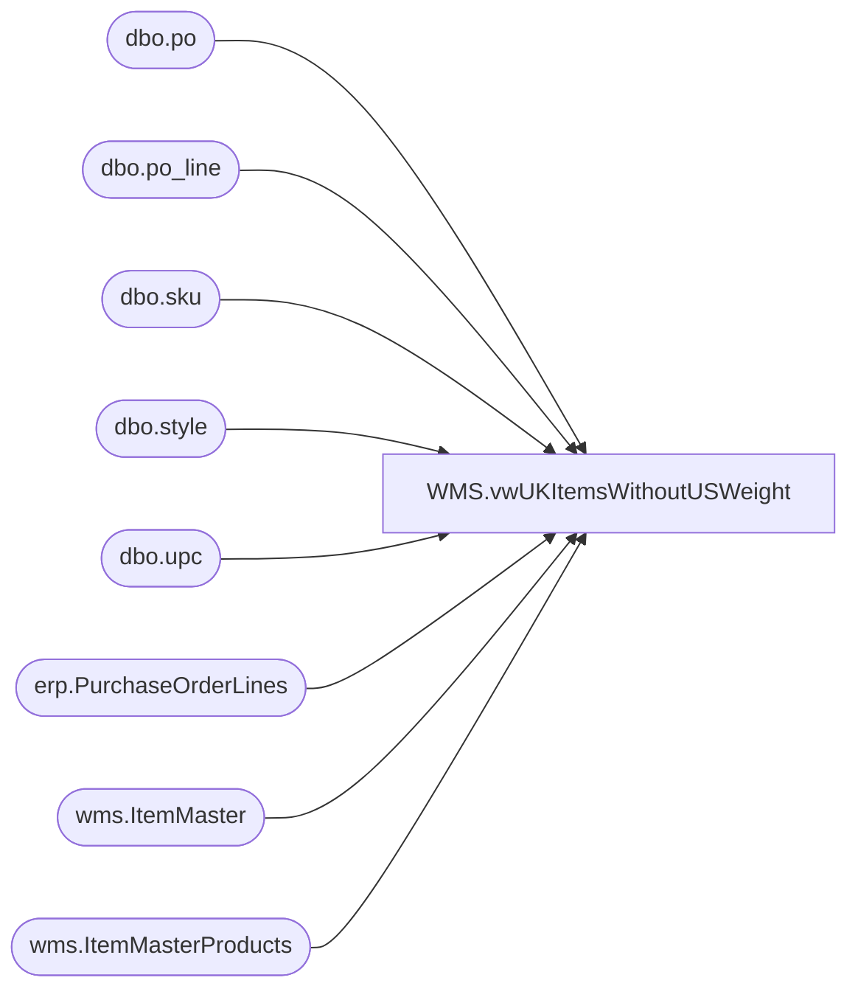

# WMS.vwUKItemsWithoutUSWeight

**Database:** IntegrationStaging  
**Server:** STL-SSIS-P-01  

## Architecture Diagram



## Table Dependencies

| Referenced Table |
|---|
| dbo.po |
| dbo.po_line |
| dbo.sku |
| dbo.style |
| dbo.upc |
| erp.PurchaseOrderLines |
| wms.ItemMaster |
| wms.ItemMasterProducts |

## View Code

```sql
CREATE view [WMS].[vwUKItemsWithoutUSWeight]

as

with 
ItemsOnPO as
	(
		select DISTINCT 
			ItemID as ProductNumber,
			max(InsertDate) CreateDate
		from erp.PurchaseOrderLines
		where left(ItemID,1) = '4'
		group by ItemID
		UNION
		select DISTINCT
			s.style_code as ProductNumber,
			max(po.create_date) CreateDate
		from bedrocktestdb02.me_01.dbo.po po with (nolock)
		join bedrocktestdb02.me_01.dbo.po_line pl with (nolock) on po.po_id = pl.po_id
		join bedrocktestdb02.me_01.dbo.sku sk with (nolock) on pl.style_color_id = sk.style_color_id
		join bedrocktestdb02.me_01.dbo.upc u with (nolock) on sk.sku_id = u.sku_id 
		join bedrocktestdb02.me_01.dbo.style s with (nolock) on sk.style_id = s.style_id
		where po.approval_status in (3,7) -- Approval
		and	po.po_status in (4,7) -- Open
		and left(s.style_code,1) ='4'
		group by s.style_code
	),
MaxPO as
	(
		select ProductNumber, max(CreateDate) CreateDate
		from ItemsOnPO 
		group by ProductNumber
	),
UKItems as 
	(
		select 
			im.ProductNumber, 
			p.ProductDescription
		from wms.ItemMaster im with (nolock)
		join wms.ItemMasterProducts p with (nolock) on im.ProductNumber=p.ProductNumber
		where left(im.ProductNumber,1) = '4'
		and im.entity = 2110 -- UK 
	),
USItemWithWeight as
	(
		select 
			uk.ProductNumber, 
			im.NetProductWeight
		from wms.ItemMaster im with (nolock)
		join UKItems uk on right(im.ProductNumber,5)=right(uk.ProductNumber,5)
		where im.entity = 1100 -- US
		and left(im.ProductNumber,1) = '0'
		and isnumeric(im.ProductNumber) =1
		and im.NetProductWeight is not null
	),
UKItemsNoUSWeight as
	(
		select 
			uk.ProductNumber,
			uk.ProductDescription,
			us.NetProductWeight
		from UKItems uk 
		left join USItemWithWeight us 
			on uk.ProductNumber=us.ProductNumber 
		where us.ProductNumber is null
	)
select 
	i.ProductNumber,
	i.ProductDescription
from UKItemsNoUSWeight i
where exists (select p.ProductNumber from ItemsOnPO p where p.ProductNumber=i.ProductNumber)
```

