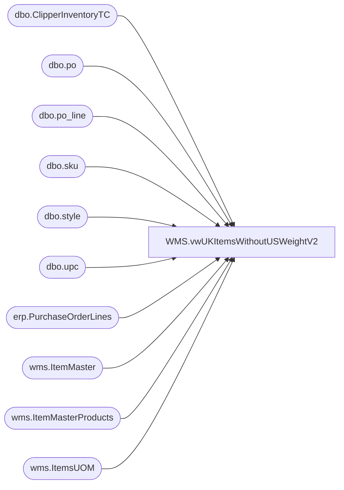

# WMS.vwUKItemsWithoutUSWeightV2

**Database:** IntegrationStaging  
**Server:** STL-SSIS-P-01  

## Architecture Diagram



## Table Dependencies

| Referenced Table |
|---|
| dbo.ClipperInventoryTC |
| dbo.po |
| dbo.po_line |
| dbo.sku |
| dbo.style |
| dbo.upc |
| erp.PurchaseOrderLines |
| wms.ItemMaster |
| wms.ItemMasterProducts |
| wms.ItemsUOM |

## View Code

```sql
CREATE view [WMS].[vwUKItemsWithoutUSWeightV2]

as

-- 20201104 --  -- Tim C --- Updated view logic to only included styles with inventory or on order. Also added additional handlning to the Issue Column. 


with 
ItemsOnPO as
	(
		select DISTINCT 
			ItemID as ProductNumber,
			max(InsertDate) CreateDate
		from erp.PurchaseOrderLines
		where left(ItemID,1) in ('4','5','6')
		group by ItemID
		UNION
		select DISTINCT
			s.style_code as ProductNumber,
			max(po.create_date) CreateDate
		from bedrockdb02.me_01.dbo.po po with (nolock)
		join bedrockdb02.me_01.dbo.po_line pl with (nolock) on po.po_id = pl.po_id
		join bedrockdb02.me_01.dbo.sku sk with (nolock) on pl.style_color_id = sk.style_color_id
		join bedrockdb02.me_01.dbo.upc u with (nolock) on sk.sku_id = u.sku_id 
		join bedrockdb02.me_01.dbo.style s with (nolock) on sk.style_id = s.style_id
		where po.approval_status in (3,7) -- Approval
		and	po.po_status in (4,7) -- Open
		and left(s.style_code,1) in ('4','5','6')
		and po.create_date > '01-01-2018' -- Added to reduce data set 
		group by s.style_code
	),
MaxPO as
	(
		select ProductNumber, max(CreateDate) CreateDate
		from ItemsOnPO 
		group by ProductNumber
	),
UKItems as 
       (
              select 
                     im.ProductNumber, 
                     p.ProductDescription,
                     im.NetProductWeight as UKItemNetProductWeight,
                     im.InventoryUnitSymbol as UKItemIventoryUnitSymbol
              from wms.ItemMaster im with (nolock)
              join wms.ItemMasterProducts p with (nolock) on im.ProductNumber=p.ProductNumber
              where left(im.ProductNumber,1) in ('4','5','6')
              and im.entity = 2110 -- UK 
       ),
USItemWithWeight as
       (
              select 
                     uk.ProductNumber UKProductNumber, 
                     im.ProductNumber USProductNumber,
                     im.NetProductWeight as WeightPound,
                     (im.NetProductWeight * 0.453592) WeightKG,
                     im.InventoryUnitSymbol,
                     uom.Factor,
                     uom.FromUnitSymbol,
                     uom.ToUnitSymbol,
                     im.UnitCost
              from wms.ItemMaster im with (nolock)
              join UKItems uk 
                     on right(im.ProductNumber,5)=right(uk.ProductNumber,5)
                           and left(uk.ProductNumber,1) = 
                                  case 
                                         when left(im.ProductNumber,1)='0' then '4'
                                         when left(im.ProductNumber,1)='2' then '5'
                                         when left(im.ProductNumber,1)='3' then '6'
                                  end
              join wms.ItemsUOM uom with (nolock) 
                     on im.Entity=uom.Entity
                     and im.ProductNumber=uom.ProductNumber
                     and uom.ToUnitSymbol = 'wmea'
                     and uom.FromUnitSymbol = im.InventoryUnitSymbol
              where im.entity = 1100 -- US
              and left(im.ProductNumber,1) in ('0','2','3')
              and isnumeric(im.ProductNumber) =1
       ) ,


Missing as (

select * 
from UKItems uk
	left join USItemWithWeight us on uk.ProductNumber=us.UKProductNumber
where (uk.ProductNumber in (select distinct style_code from bedrockdb02.me_01.dbo.ClipperInventoryTC where booked> 0 or available > 0 or allocated > 0 )
	or uk.ProductNumber in (select distinct ProductNumber from ItemsOnPO ) -- On order but this may be flawed, as some POs stay open "forever ", so added date filter on create date
	) 
	and us.USProductNumber is null

), 
UOM as (

select im.ProductNumber USProductNumber,
im.NetProductWeight as WeightPound,
(im.NetProductWeight * 0.453592) WeightKG,
im.InventoryUnitSymbol,
im.UnitCost, 
uom.ProductNumber as UomProductNumber,
uom.Factor, 
uom.FromUnitSymbol
from wms.ItemMaster im with (nolock)
left join wms.ItemsUOM uom with (nolock) 
       on im.Entity=uom.Entity
       and im.ProductNumber=uom.ProductNumber
	   and uom.ToUnitSymbol = 'wmea'
       and uom.FromUnitSymbol = im.InventoryUnitSymbol
where im.entity = 1100 -- US
and left(im.productnumber,1) = '0'
and right(im.ProductNumber,5) in (select distinct right(ProductNumber,5) from Missing)
and uom.FromUnitSymbol is null

), 

Zeroes as (

select * 
from UKItems uk
	left join USItemWithWeight us on uk.ProductNumber=us.UKProductNumber
where (uk.ProductNumber in (select distinct style_code from bedrockdb02.me_01.dbo.ClipperInventoryTC where booked> 0 or available > 0 or allocated > 0 )
	or uk.ProductNumber in (select distinct ProductNumber from ItemsOnPO ) -- On order but this may be flawed, as some POs stay open "forever ", so added date filter on create date
	) 
	and (us.WeightPound = 0 or us.UnitCost = 0) 
	
	)


select m.ProductNumber, 
m.ProductDescription, 
u.USProductNumber,
u.UomProductNumber,
u.Factor, 
u.FromUnitSymbol, 
case when u.USProductNumber is null then 'No US Counterpart and Missing UOM '
	when u.USProductNumber is not null then 'Missing UOM '
	else 'Other'
	end as 'Issue'
from Missing m
left join Uom u on right(u.USProductNumber,5)=right(m.ProductNumber,5) 
union all 
select z.ProductNumber, 
z.productDescription, 
z.UsProductNumber,
'N\A' as UomProductNumber, 
z.Factor,
z.FromUnitSymbol, 
case when z.UnitCost = '0' and z.WeightPound <> '0'
	then 'Unit Cost = $0'
	when z.WeightPound = '0' and z.UnitCost <> '0'
	then 'Unit weight = 0'
	when z.UnitCost = '0' and z.WeightPound = '0' 
	then 'Both Weight and Cost = 0'
	else 'Other'
	end as 'Issue'
from Zeroes z
```

