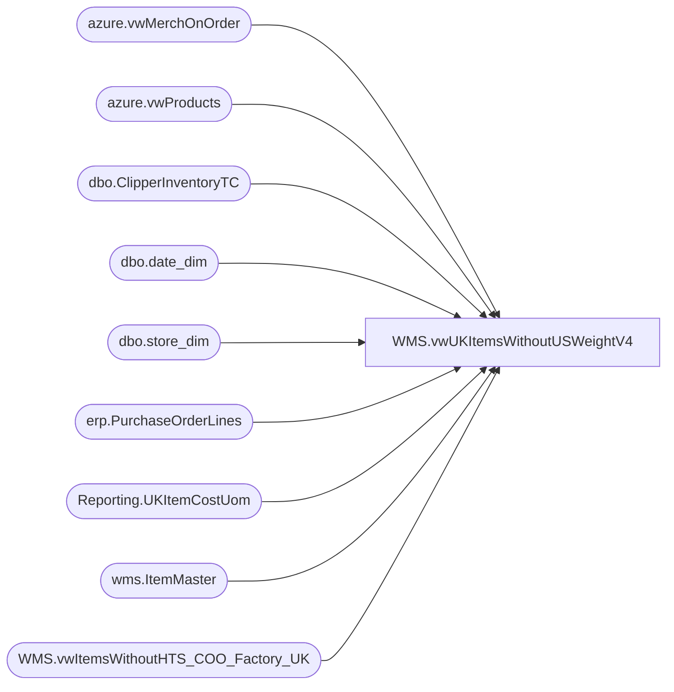

# WMS.vwUKItemsWithoutUSWeightV4

**Database:** IntegrationStaging  
**Server:** STL-SSIS-P-01  

## Architecture Diagram



## Table Dependencies

| Referenced Table |
|---|
| azure.vwMerchOnOrder |
| azure.vwProducts |
| dbo.ClipperInventoryTC |
| dbo.date_dim |
| dbo.store_dim |
| erp.PurchaseOrderLines |
| Reporting.UKItemCostUom |
| wms.ItemMaster |
| WMS.vwItemsWithoutHTS_COO_Factory_UK |

## View Code

```sql
CREATE view [WMS].[vwUKItemsWithoutUSWeightV4]

as

with 
ItemsOnPO as
	(
		select DISTINCT 
			ItemID as ProductNumber,
			max(InsertDate) CreateDate
		from erp.PurchaseOrderLines
		where left(ItemID,1) in ('4','5','6')
		group by ItemID
		UNION
		select distinct p.Style,
			cast(max(dd.actual_date) as date) as CreateDate
		from papamart.dw.azure.vwMerchOnOrder o
		join papamart.dw.azure.vwProducts p on o.style_id=p.ProductKey
		join papamart.dw.dbo.date_dim dd on cast(o.DateKey as date)=cast(dd.actual_date as date)
		join papamart.dw.dbo.store_dim sd on o.Location_id=sd.store_key
		where sd.store_id = '2970'
		group by p.Style
	),
MaxPO as
	(
		select ProductNumber, max(CreateDate) CreateDate
		from ItemsOnPO 
		group by ProductNumber
	)

	
select u.ProductNumber, 
u.ProductDescription, 
im.NecessaryProductionWorkingTimeSchedulingPropertyId as ItemType, 
'Missing UOM Conversion to WMEA' as Issue
from Reporting.[UKItemCostUom] u 
join wms.ItemMaster im on u.ProductNumber=im.ProductNumber
		and im.Entity = '2110'	
where (u.WeightKg is null and u.ProductNumber in (select distinct style_code from bedrockdb02.me_01.dbo.ClipperInventoryTC where booked> 0 or available > 0 or allocated > 0 ))

union all

select u.ProductNumber, 
u.ProductDescription, 
im.NecessaryProductionWorkingTimeSchedulingPropertyId as ItemType, 
'Missing UOM Conversion to WMEA' as Issue
from Reporting.[UKItemCostUom] u 
join wms.ItemMaster im on u.ProductNumber=im.ProductNumber
		and im.Entity = '2110'	
where (u.WeightKg is null and u.ProductNumber in (select ProductNumber from ItemsOnPO ))

union all

select u.ProductNumber, 
u.ProductDescription, 
im.NecessaryProductionWorkingTimeSchedulingPropertyId as ItemType, 
'Zero Cost' as Issue
from Reporting.[UKItemCostUom] u 
join wms.ItemMaster im on u.ProductNumber=im.ProductNumber
		and im.Entity = '2110'	
where U.UnitCost = 0
and (u.ProductNumber in (select distinct style_code from bedrockdb02.me_01.dbo.ClipperInventoryTC where booked> 0 or available > 0 or allocated > 0 )
)

UNION ALL 

select u.ProductNumber, 
u.ProductDescription, 
im.NecessaryProductionWorkingTimeSchedulingPropertyId as ItemType, 
'Zero Weight' as Issue
from Reporting.[UKItemCostUom] u 
join wms.ItemMaster im on u.ProductNumber=im.ProductNumber
		and im.Entity = '2110'	
where ((u.WEIGHTKG IS NOT NULL and u.WeightKg = '0') or (u.WeightKG is null) )
and (u.ProductNumber in (select distinct style_code from bedrockdb02.me_01.dbo.ClipperInventoryTC where booked> 0 or available > 0 or allocated > 0 ))

UNION ALL 

select u.ProductNumber, 
u.ProductDescription, 
im.NecessaryProductionWorkingTimeSchedulingPropertyId as ItemType, 
'Zero Weight' as Issue
from Reporting.[UKItemCostUom] u 
join wms.ItemMaster im on u.ProductNumber=im.ProductNumber
		and im.Entity = '2110'	
where ((u.WEIGHTKG IS NOT NULL and u.WeightKg = '0') or (u.WeightKG is null) ) and (u.ProductNumber in (select  ProductNumber from ItemsOnPO ) )

union all 

SELECT [ProductNumber]
      --,[ProductName] as 'ProductDescription'
	  ,[ProductDescription]
      ,[MerchOrSupply] as ItemType,
	  'No HTS code' as Issue
  FROM [WMS].[vwItemsWithoutHTS_COO_Factory_UK]
  where HTScode1100 is null or  HTScode1100 = ''

  --select * FROM [WMS].[vwItemsWithoutHTS_COO_Factory_UK]

 union all 

SELECT [ProductNumber]
      --,[ProductName] as 'ProductDescription'
	   ,[ProductDescription]
      ,[MerchOrSupply] as ItemType,
	  'No Country Of Origin' as Issue
  FROM [WMS].[vwItemsWithoutHTS_COO_Factory_UK]
  where COO1100 is null or COO1100 = ''
```

