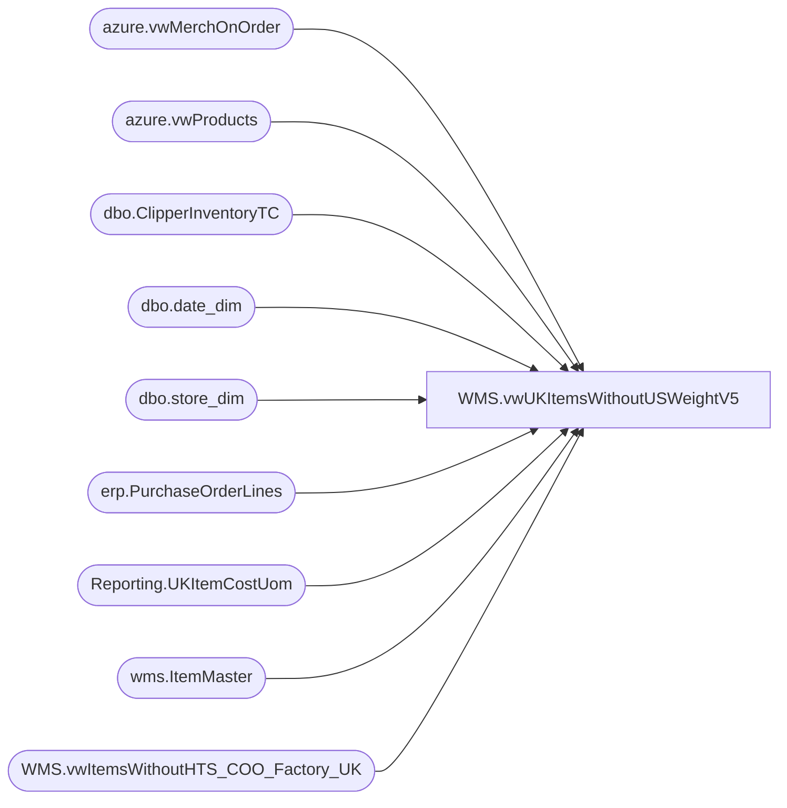

# WMS.vwUKItemsWithoutUSWeightV5

**Database:** IntegrationStaging  
**Server:** STL-SSIS-P-01  

## Architecture Diagram



## Table Dependencies

| Referenced Table |
|---|
| azure.vwMerchOnOrder |
| azure.vwProducts |
| dbo.ClipperInventoryTC |
| dbo.date_dim |
| dbo.store_dim |
| erp.PurchaseOrderLines |
| Reporting.UKItemCostUom |
| wms.ItemMaster |
| WMS.vwItemsWithoutHTS_COO_Factory_UK |

## View Code

```sql
CREATE view [WMS].[vwUKItemsWithoutUSWeightV5]

as

with 
ItemsOnPOorOnHand as
	(
		select DISTINCT ItemID as ProductNumber
			--,max(InsertDate) CreateDate
		--select *
		from erp.PurchaseOrderLines
		where left(ItemID,1) in ('4','5','6')
		--order by ItemID asc
		group by ItemID
		
		UNION
		
		select distinct p.Style
			--,cast(max(dd.actual_date) as date) as CreateDate
		from papamart.dw.azure.vwMerchOnOrder o
		join papamart.dw.azure.vwProducts p on o.style_id=p.ProductKey
		join papamart.dw.dbo.date_dim dd on cast(o.DateKey as date)=cast(dd.actual_date as date)
		join papamart.dw.dbo.store_dim sd on o.Location_id=sd.store_key
		where sd.store_id = '2970'
		group by p.Style
		--order by p.Style asc

		union 

		select distinct style_code from bedrockdb02.me_01.dbo.ClipperInventoryTC where booked> 0 or available > 0 or allocated > 0 
		-- Replace Above with below when ready for Aptos Decom Cutover 
		/*
		select distinct ItemNumber as style_code
		from wms.InventorySync3PLArchive (nolock) 
		where 1=1
		and Entity = '2110'
		and InventoryDate =  (select max (InventoryDate) as MaxInventoryDate from wms.InventorySync3PLArchive (nolock) where 1=1  and entity = '2110')
		and WhseQty <> 0
		*/
		--order by style_code asc

	)
	

select u.ProductNumber, u.ProductDescription, im.NecessaryProductionWorkingTimeSchedulingPropertyId as ItemType, 'Missing UOM Conversion to WMEA' as Issue
from Reporting.[UKItemCostUom] u 
join wms.ItemMaster im on u.ProductNumber=im.ProductNumber and im.Entity = '2110'	
where (u.WeightKg is null and u.ProductNumber in (select ProductNumber from ItemsOnPOorOnHand))

union all

--select u.ProductNumber, u.ProductDescription, im.NecessaryProductionWorkingTimeSchedulingPropertyId as ItemType, 'Zero Cost' as Issue
--from Reporting.[UKItemCostUom] u 
--join wms.ItemMaster im on u.ProductNumber=im.ProductNumber and im.Entity = '2110'	
--where U.UnitCost = 0
--and u.ProductNumber in (select ProductNumber from ItemsOnPOorOnHand)


select u.ProductNumber, u.ProductDescription, im.NecessaryProductionWorkingTimeSchedulingPropertyId as ItemType, 'Zero Cost' as Issue
--,max(u.UnitCost)
from Reporting.[UKItemCostUom] u 
join wms.ItemMaster im on u.ProductNumber=im.ProductNumber and im.Entity = '2110'	
where u.ProductNumber in (select ProductNumber from ItemsOnPOorOnHand)
group by u.ProductNumber, u.ProductDescription,  im.NecessaryProductionWorkingTimeSchedulingPropertyId
having max(U.UnitCost) = 0


UNION ALL 

select u.ProductNumber, u.ProductDescription, im.NecessaryProductionWorkingTimeSchedulingPropertyId as ItemType, 'Zero Weight' as Issue
from Reporting.[UKItemCostUom] u 
join wms.ItemMaster im on u.ProductNumber=im.ProductNumber and im.Entity = '2110'	
where ((u.WEIGHTKG IS NOT NULL and u.WeightKg = '0') or (u.WeightKG is null) ) and u.ProductNumber in (select ProductNumber from ItemsOnPOorOnHand)

union all 

--SELECT h.[ProductNumber],h.[ProductDescription],h.[MerchOrSupply] as ItemType,'No HTS code' as Issue
SELECT h.[ProductNumber],u.[ProductDescription],h.[MerchOrSupply] as ItemType,'No HTS code' as Issue
 FROM [WMS].[vwItemsWithoutHTS_COO_Factory_UK] h
 join Reporting.[UKItemCostUom] u with (nolock) on h.ProductNumber = u.ProductNumber
 where h.HarmonizedSystemCode is null or h.HarmonizedSystemCode = '' and h.ProductNumber in (select ProductNumber from ItemsOnPOorOnHand)
 --where h.HTScode1100 is null or  h.HTScode1100 = '' and h.ProductNumber in (select ProductNumber from ItemsOnPOorOnHand)
 -- where h.HTScode1100 is null or  h.HTScode1100 = '' and h.ProductNumber in (457426)

union all 

--select im.ProductNumber, ProductSearchName  as ProductDescription,[NecessaryProductionWorkingTimeSchedulingPropertyId] as ItemType,'No COO code' as Issue
select im.ProductNumber, u.ProductDescription  as ProductDescription,[NecessaryProductionWorkingTimeSchedulingPropertyId] as ItemType,'No COO code' as Issue
from wms.ItemMaster im with (nolock)
join Reporting.[UKItemCostUom] u with (nolock) on im.ProductNumber = u.ProductNumber
where Entity = 2110 and im.ProductNumber in (select ProductNumber from ItemsOnPOorOnHand) and (im.OriginCountryRegionId is null or im.OriginCountryRegionId = '')
--where Entity = 2110 and  im.ProductNumber in (457426)
```

