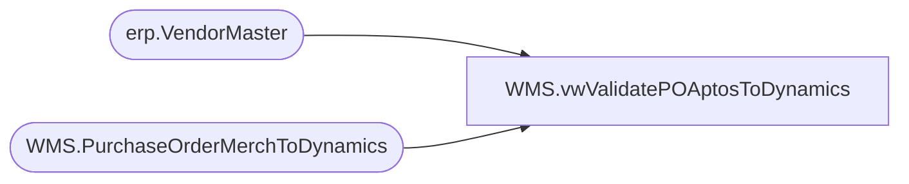

# WMS.vwValidatePOAptosToDynamics

**Database:** IntegrationStaging  
**Server:** STL-SSIS-P-01  

## Architecture Diagram



## Table Dependencies

| Referenced Table |
|---|
| erp.VendorMaster |
| WMS.PurchaseOrderMerchToDynamics |

## View Code

```sql
CREATE view [WMS].[vwValidatePOAptosToDynamics] 

as

with APIview as
	(
		select  --1200 PO
			po.PONumber,
			po.POLineNumber
		from WMS.PurchaseOrderMerchToDynamics po with (nolock)
		join erp.VendorMaster vm with (nolock) 
			on vm.Entity = 1200
			and cast(po.VendorCode as nvarchar) =
				case 
					when vm.OrganizationPhoneticName like '%-%' 
					then substring(vm.OrganizationPhoneticName, 1, charindex('-',vm.OrganizationPhoneticName)-1) 
					else vm.OrganizationPhoneticName 
				end
			and po.FactoryCode =
				case 
					when vm.OrganizationPhoneticName like '%-%' 
					then substring(vm.OrganizationPhoneticName, charindex('-',vm.OrganizationPhoneticName)+1, 20) 
					else po.FactoryCode
				end
	),
ValidationView as
	(	
		select  --1200 PO
			po.PONumber,
			po.POLineNumber,
			isnull(po.UpdateDate, po.InsertDate) as StageDate,
			po.VendorCode,
			po.FactoryCode,
			po.BatchID
		from WMS.PurchaseOrderMerchToDynamics po with (nolock)
		left join erp.VendorMaster vm with (nolock) 
			on vm.Entity = 1200
			and cast(po.VendorCode as nvarchar) =
				case 
					when vm.OrganizationPhoneticName like '%-%' 
					then substring(vm.OrganizationPhoneticName, 1, charindex('-',vm.OrganizationPhoneticName)-1) 
					else vm.OrganizationPhoneticName 
				end
			and po.FactoryCode =
				case 
					when vm.OrganizationPhoneticName like '%-%' 
					then substring(vm.OrganizationPhoneticName, charindex('-',vm.OrganizationPhoneticName)+1, 20) 
					else po.FactoryCode
				end
	)
select 
	vv.PONumber,
	vv.POLineNumber,
	vv.VendorCode,
	vv.FactoryCode,
	vv.StageDate,
	case when concat(vv.VendorCode,'-', vv.FactoryCode) in (select OrganizationPhoneticName from erp.VendorMaster with (nolock) where entity=1200)
		then 'YES'
		else 'NO'
	end as VendorFactoryInDynamics,
	vv.BatchID
from ValidationView vv 
left join APIview av 
	on vv.PONumber=av.PONumber
	and vv.POLineNumber=av.POLineNumber
where av.POLineNumber is NULL
```

