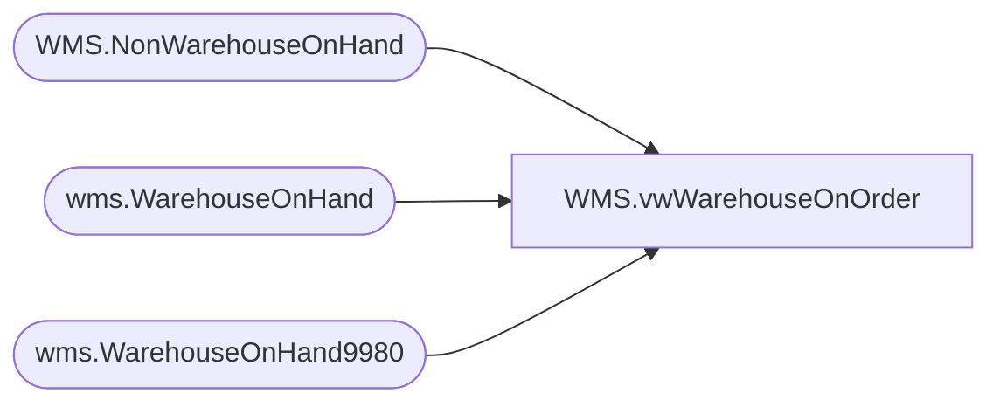

# WMS.vwWarehouseOnOrder

**Database:** IntegrationStaging  
**Server:** STL-SSIS-P-01  

## Architecture Diagram



## Table Dependencies

| Referenced Table |
|---|
| WMS.NonWarehouseOnHand |
| wms.WarehouseOnHand |
| wms.WarehouseOnHand9980 |

## View Code

```sql
CREATE view [WMS].[vwWarehouseOnOrder]

as 

select distinct ItemId as ItemNumber
from WMS.NonWarehouseOnHand i
where 1=1
and TRY_CAST(i.InventLocationId AS INT) IS NOT NULL
and i.ItemId LIKE '[0-9]%'  
and i.InventStatusId = 'AVAIL'
--and i.OnOrder > 100 -- EWG Remark: Ordered in total: inbound TOs and POs ; On order: Outbound TOs and SOs
and i.Ordered > 100 -- EWG Remark: Ordered in total: inbound TOs and POs ; On order: Outbound TOs and SOs
	union 
select distinct ItemId
from wms.WarehouseOnHand9980 i
where 1=1
and TRY_CAST(i.InventLocationId AS INT) IS NOT NULL
and i.ItemId LIKE '[0-9]%'  
--and i.OnOrder > 100 -- EWG Remark: Ordered in total: inbound TOs and POs ; On order: Outbound TOs and SOs
and i.Ordered > 100 -- EWG Remark: Ordered in total: inbound TOs and POs ; On order: Outbound TOs and SOs
	 union
select  distinct ItemNumber
from wms.WarehouseOnHand i
where 1=1
and TRY_CAST(i.InventoryWarehouseId AS INT) IS NOT NULL
and i.ItemNumber LIKE '[0-9]%'  
--and i.OnOrderQuantity > 100 -- EWG Remark: Ordered in total: inbound TOs and POs ; On order: Outbound TOs and SOs
and i.OrderedQuantity > 100 -- EWG Remark: Ordered in total: inbound TOs and POs ; On order: Outbound TOs and SOs
```

