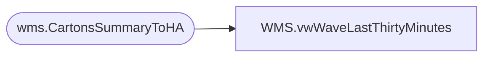

# WMS.vwWaveLastThirtyMinutes

**Database:** IntegrationStaging  
**Server:** STL-SSIS-P-01  

## Architecture Diagram



## Table Dependencies

| Referenced Table |
|---|
| wms.CartonsSummaryToHA |

## View Code

```sql
CREATE view [WMS].[vwWaveLastThirtyMinutes]

as

-- Wave Time Stamp 
with WaveTime 
as 
(
	select WaveId, 
	convert(varchar,dateadd(hh,-5, max(MessageDateUTC)),100) as WaveMessageTime
	from wms.CartonsSummaryToHA
	group by waveId

)


select *
from WaveTime wt
--where datediff(mi,wt.WaveMessageTime, convert(varchar,getdate (),100)) <= 30 -- Replaced 2/18/2020, needed to account for Ohio time 
where datediff(mi,wt.WaveMessageTime, convert(varchar,dateadd(hh,1,getdate ()),100)) <= '30'
```

