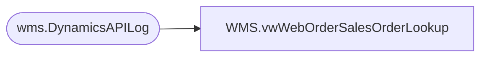

# WMS.vwWebOrderSalesOrderLookup

**Database:** IntegrationStaging  
**Server:** STL-SSIS-P-01  

## Architecture Diagram



## Table Dependencies

| Referenced Table |
|---|
| wms.DynamicsAPILog |

## View Code

```sql
CREATE view [WMS].[vwWebOrderSalesOrderLookup] 

as 

With
WebOrderLookup as
	(
		select  
			--replace(substring(MergedJson,charindex('eCommOrderRefNum', MergedJson)+20, 12), '",', '') as WebOrderNumber,
			WebOrderNumber,
			min(substring(ResponseBody,charindex('sales order SO', ResponseBody)+12, 12)) as SalesOrderNumber --if multi, gets first only
		from wms.DynamicsAPILog with (nolock)
		where 1=1
		and HttpResponseURL like 'https://buildabear%.operations.dynamics.com%'
		and IntegrationName = 'WM Import OMS'
		and ResponseBody is not null
		and substring(ResponseBody, charindex('hasErrors', ResponseBody)+11, 5) = 'false'
		and isnumeric(right(substring(ResponseBody,charindex('sales order SO', ResponseBody)+12, 12),10)) = 1
		group by 
			WebOrderNumber
--			replace(substring(MergedJson,charindex('eCommOrderRefNum', MergedJson)+20, 12), '",', '')
	),
MinWO as
	(
		select
			min(WebOrderNumber) WebOrderNumber, -- taking min in case there are dupes... shouldn't be - would mean that multiple web orders got onto same sales order
			SalesOrderNumber
		from WebOrderLookup
		group by SalesOrderNumber
	) 
select 
	WebOrderNumber,
	SalesOrderNumber
from MinWO
```

