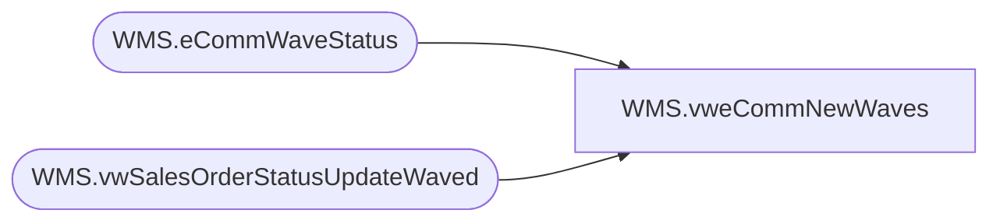

# WMS.vweCommNewWaves

**Database:** IntegrationStaging  
**Server:** STL-SSIS-P-01  

## Architecture Diagram



## Table Dependencies

| Referenced Table |
|---|
| WMS.eCommWaveStatus |
| WMS.vwSalesOrderStatusUpdateWaved |

## View Code

```sql
CREATE VIEW [WMS].[vweCommNewWaves]
AS
SELECT v.[WaveId]
FROM [IntegrationStaging].[WMS].[vwSalesOrderStatusUpdateWaved] v
LEFT JOIN [IntegrationStaging].[WMS].[eCommWaveStatus] e WITH(NOLOCK) ON v.WaveId = e.WaveID
WHERE e.WaveId IS NULL AND v.WaveId IS NOT NULL
GROUP BY v.WaveId
```

