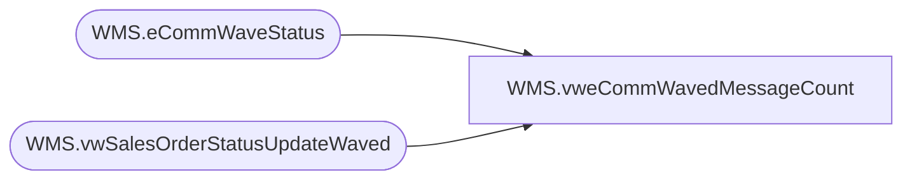

# WMS.vweCommWavedMessageCount

**Database:** IntegrationStaging  
**Server:** STL-SSIS-P-01  

## Architecture Diagram



## Table Dependencies

| Referenced Table |
|---|
| WMS.eCommWaveStatus |
| WMS.vwSalesOrderStatusUpdateWaved |

## View Code

```sql
CREATE VIEW [WMS].[vweCommWavedMessageCount]
AS
SELECT        v.WaveId, COUNT(v.WaveId) AS 'MessageCount'
FROM            WMS.vwSalesOrderStatusUpdateWaved AS v LEFT OUTER JOIN
                         WMS.eCommWaveStatus AS e WITH(NOLOCK) ON v.WaveId = e.WaveID
WHERE        (e.isWaved = 0)
GROUP BY v.WaveId
```

