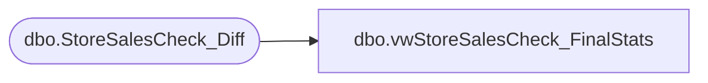

# dbo.vwStoreSalesCheck_FinalStats

**Database:** IntegrationStaging  
**Server:** STL-SSIS-P-01  

## Architecture Diagram



## Table Dependencies

| Referenced Table |
|---|
| dbo.StoreSalesCheck_Diff |

## View Code

```sql
CREATE view [dbo].[vwStoreSalesCheck_FinalStats]

as 

with
DataPrep1 as
	(
		select 
			store_id as StoreID,
			cast(cast(replace(store_units,'','0.0000') as int) as numeric(10,4)) as StoreUnits,
			cast(cast(replace(aw_units,'','0.0000') as int) as numeric(10,4)) as AWUnits
		from StoreSalesCheck_Diff
	),
DataPrep2 as
	(
		select 
			StoreID,
			StoreUnits,
			AWUnits,
			cast((cast(isnull((AWUnits / nullif(StoreUnits,0)),0) as numeric(10,2)) * 100) as numeric(10,0)) as PercentPosted,
			cast(cast((StoreUnits - AWUnits) as numeric(10,4)) as int) as UnitsNotPosted 
		from DataPrep1
		where isnull(AWUnits,0) < isnull(StoreUnits,0)
	),
DataPrep3 as
	(
		select 
			StoreID,
			StoreUnits,
			AWUnits,
			UnitsNotPosted,
			PercentPosted,
			cast((cast(isnull((UnitsNotPosted / nullif(StoreUnits,0)),0) as numeric(10,2)) * 100) as numeric(10,0)) as PercentNotPosted
		from DataPrep2
	),
DataPrep4 as
	(
		select 
			count(*) as StoreCount,
			sum(case 
					when StoreID in (13, 2013) and (PercentNotPosted >=25 OR PercentPosted=0)
						then 1
					else 0
				end) as WebStoresMissing25Pct,
			sum(case 
					when StoreID not in (13, 2013) and (PercentNotPosted >=25 OR PercentPosted=0)
						then 1
					else 0
				end) as NonWebStoresMissing25Pct,
			sum(StoreUnits) StoreUnits,
			sum(AWUnits) AWUnits
		from DataPrep3
	)
select 
	StoreCount,
	WebStoresMissing25Pct, 
	NonWebStoresMissing25Pct,
	cast((cast(isnull((AWUnits / nullif(StoreUnits,0)),0) as numeric(10,2)) * 100) as numeric(10,0)) PercentPosted
from DataPrep4
```

