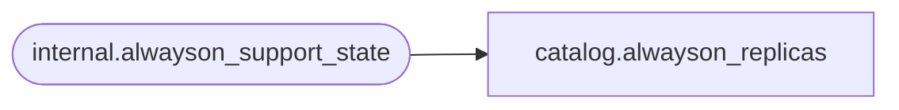

# catalog.alwayson_replicas

**Database:** SSISDB  
**Server:** STL-SSIS-P-01  

## Architecture Diagram



## Table Dependencies

| Referenced Table |
|---|
| internal.alwayson_support_state |

## View Code

```sql
CREATE VIEW [catalog].[alwayson_replicas] 
AS
SELECT		[server_name],
			[state]
FROM		[internal].[alwayson_support_state]
```

