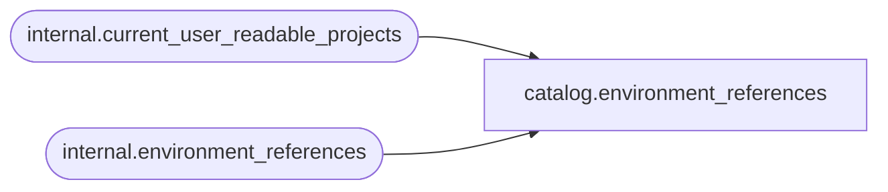

# catalog.environment_references

**Database:** SSISDB  
**Server:** STL-SSIS-P-01  

## Architecture Diagram



## Table Dependencies

| Referenced Table |
|---|
| internal.current_user_readable_projects |
| internal.environment_references |

## View Code

```sql
CREATE VIEW [catalog].[environment_references]
AS
SELECT     [reference_id], 
           [project_id], 
           [reference_type], 
           [environment_folder_name], 
           [environment_name], 
           [validation_status], 
           [last_validation_time]
FROM       [internal].[environment_references]
WHERE      [project_id] in (SELECT [id] FROM [internal].[current_user_readable_projects])
           OR (IS_MEMBER('ssis_admin') = 1)
           OR (IS_SRVROLEMEMBER('sysadmin') = 1)
```

