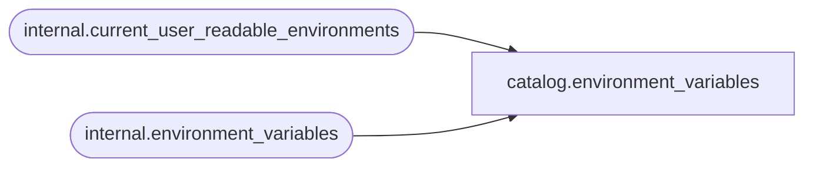

# catalog.environment_variables

**Database:** SSISDB  
**Server:** STL-SSIS-P-01  

## Architecture Diagram



## Table Dependencies

| Referenced Table |
|---|
| internal.current_user_readable_environments |
| internal.environment_variables |

## View Code

```sql
CREATE VIEW [catalog].[environment_variables]
AS
SELECT     [variable_id], 
           [environment_id], 
           [name],
           [description],
           [type], 
           [sensitive], 
           [value]
FROM       [internal].[environment_variables]
WHERE      [environment_id] in (SELECT [id] FROM [internal].[current_user_readable_environments])
           OR (IS_MEMBER('ssis_admin') = 1)
           OR (IS_SRVROLEMEMBER('sysadmin') = 1)
```

