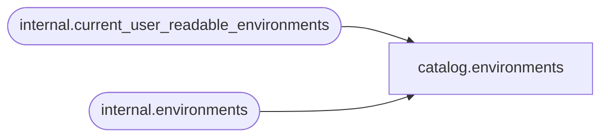

# catalog.environments

**Database:** SSISDB  
**Server:** STL-SSIS-P-01  

## Architecture Diagram



## Table Dependencies

| Referenced Table |
|---|
| internal.current_user_readable_environments |
| internal.environments |

## View Code

```sql
CREATE VIEW [catalog].[environments]
AS
SELECT     
           [environment_id],
           [environment_name] AS [name], 
           [folder_id],
           [description],
           [created_by_sid], 
           [created_by_name],
           [created_time]  
FROM       [internal].[environments]
WHERE      [environment_id] in (SELECT [id] FROM [internal].[current_user_readable_environments])
           OR (IS_MEMBER('ssis_admin') = 1)
           OR (IS_SRVROLEMEMBER('sysadmin') = 1)
```

