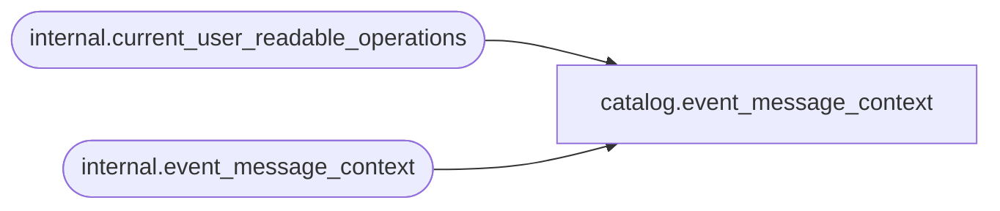

# catalog.event_message_context

**Database:** SSISDB  
**Server:** STL-SSIS-P-01  

## Architecture Diagram



## Table Dependencies

| Referenced Table |
|---|
| internal.current_user_readable_operations |
| internal.event_message_context |

## View Code

```sql
CREATE VIEW [catalog].[event_message_context]
AS
SELECT     [context_id],
           [event_message_id],
           [context_depth],
           [package_path],
           [context_type],
           [context_source_name],
           [context_source_id],
           [property_name],
           [property_value]
FROM       [internal].[event_message_context]
WHERE      [operation_id] in (SELECT [id] FROM [internal].[current_user_readable_operations])
           OR (IS_MEMBER('ssis_admin') = 1)
           OR (IS_SRVROLEMEMBER('sysadmin') = 1)
           OR (IS_MEMBER('ssis_logreader') = 1)
```

