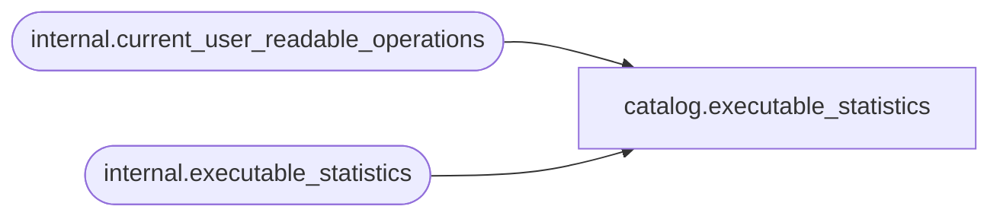

# catalog.executable_statistics

**Database:** SSISDB  
**Server:** STL-SSIS-P-01  

## Architecture Diagram



## Table Dependencies

| Referenced Table |
|---|
| internal.current_user_readable_operations |
| internal.executable_statistics |

## View Code

```sql
CREATE VIEW [catalog].[executable_statistics]
AS
SELECT     [statistics_id], 
           [execution_id],
           [executable_id], 
           [execution_path], 
           [start_time],
           [end_time],
           [execution_duration], 
           [execution_result],
           [execution_value]
FROM       [internal].[executable_statistics]
WHERE      [execution_id] in (SELECT id FROM [internal].[current_user_readable_operations])
           OR (IS_MEMBER('ssis_admin') = 1)
           OR (IS_SRVROLEMEMBER('sysadmin') = 1)
           OR (IS_MEMBER('ssis_logreader') = 1)
```

