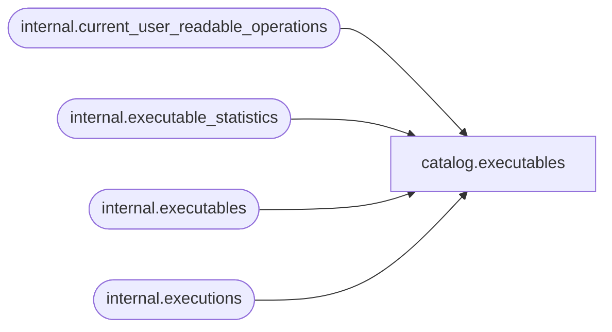

# catalog.executables

**Database:** SSISDB  
**Server:** STL-SSIS-P-01  

## Architecture Diagram



## Table Dependencies

| Referenced Table |
|---|
| internal.current_user_readable_operations |
| internal.executable_statistics |
| internal.executables |
| internal.executions |

## View Code

```sql
CREATE VIEW [catalog].[executables]
AS
SELECT DISTINCT    
           execl.[executable_id], 
           execs.[execution_id], 
           execl.[executable_name], 
           execl.[executable_guid],
           execl.[package_name],
           execl.[package_path]
FROM       ([internal].[executions] execs INNER JOIN [internal].[executable_statistics] stat 
           ON execs.[execution_id] = stat.[execution_id]) INNER JOIN [internal].[executables] execl
           ON stat.[executable_id] = execl.[executable_id] 
WHERE      execs.[execution_id] in (SELECT id FROM [internal].[current_user_readable_operations])
           OR (IS_MEMBER('ssis_admin') = 1)
           OR (IS_SRVROLEMEMBER('sysadmin') = 1)
           OR (IS_MEMBER('ssis_logreader') = 1)
```

