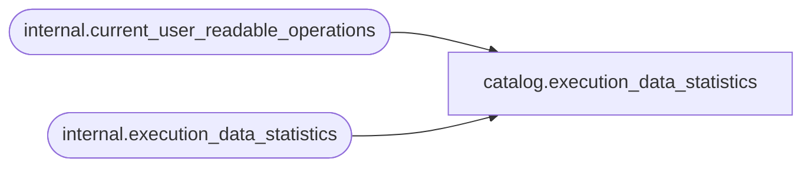

# catalog.execution_data_statistics

**Database:** SSISDB  
**Server:** STL-SSIS-P-01  

## Architecture Diagram



## Table Dependencies

| Referenced Table |
|---|
| internal.current_user_readable_operations |
| internal.execution_data_statistics |

## View Code

```sql
CREATE VIEW [catalog].[execution_data_statistics]
AS
SELECT    [data_stats_id],
          [execution_id],
          [package_name],
          [task_name],
          [dataflow_path_id_string],
          [dataflow_path_name],
          [source_component_name],
          [destination_component_name],
          [rows_sent],
          [created_time],
          [execution_path]
FROM      [internal].[execution_data_statistics]
WHERE     [execution_id] in (SELECT [id] FROM [internal].[current_user_readable_operations])
          OR (IS_MEMBER('ssis_admin') = 1)
          OR (IS_SRVROLEMEMBER('sysadmin') = 1)
          OR (IS_MEMBER('ssis_logreader') = 1)
```

