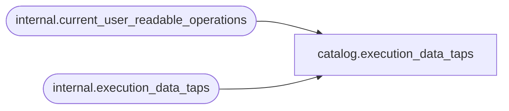

# catalog.execution_data_taps

**Database:** SSISDB  
**Server:** STL-SSIS-P-01  

## Architecture Diagram



## Table Dependencies

| Referenced Table |
|---|
| internal.current_user_readable_operations |
| internal.execution_data_taps |

## View Code

```sql
CREATE VIEW [catalog].[execution_data_taps]
AS
SELECT    [data_tap_id],
          [execution_id],
          [package_path],
          [dataflow_path_id_string],
          [dataflow_task_guid],
          [max_rows],
          [filename]
FROM      [internal].[execution_data_taps]
WHERE     [execution_id] in (SELECT [id] FROM [internal].[current_user_readable_operations])
          OR (IS_MEMBER('ssis_admin') = 1)
          OR (IS_SRVROLEMEMBER('sysadmin') = 1)
          OR (IS_MEMBER('ssis_logreader') = 1)
```

