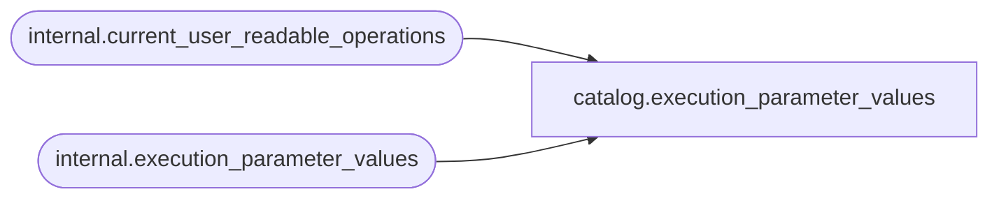

# catalog.execution_parameter_values

**Database:** SSISDB  
**Server:** STL-SSIS-P-01  

## Architecture Diagram



## Table Dependencies

| Referenced Table |
|---|
| internal.current_user_readable_operations |
| internal.execution_parameter_values |

## View Code

```sql
CREATE VIEW [catalog].[execution_parameter_values]
AS
SELECT     [execution_parameter_id], 
           [execution_id],
           [object_type], 
           [parameter_data_type], 
           [parameter_name], 
           [parameter_value], 
           [sensitive],
           [required],
           [value_set], 
           [runtime_override]
FROM       [internal].[execution_parameter_values]
WHERE      [execution_id] in (SELECT [id] FROM [internal].[current_user_readable_operations])
           OR (IS_MEMBER('ssis_admin') = 1)
           OR (IS_SRVROLEMEMBER('sysadmin') = 1)
           OR (IS_MEMBER('ssis_logreader') = 1)
```

