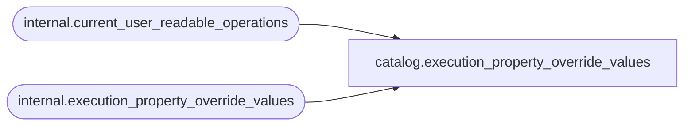

# catalog.execution_property_override_values

**Database:** SSISDB  
**Server:** STL-SSIS-P-01  

## Architecture Diagram



## Table Dependencies

| Referenced Table |
|---|
| internal.current_user_readable_operations |
| internal.execution_property_override_values |

## View Code

```sql
CREATE VIEW [catalog].[execution_property_override_values]
AS
SELECT     [property_id], 
           [execution_id],
           [property_path], 
           [property_value], 
           [sensitive]
FROM       [internal].[execution_property_override_values]
WHERE      [execution_id] in (SELECT [id] FROM [internal].[current_user_readable_operations])
           OR (IS_MEMBER('ssis_admin') = 1)
           OR (IS_SRVROLEMEMBER('sysadmin') = 1)
           OR (IS_MEMBER('ssis_logreader') = 1)
```

