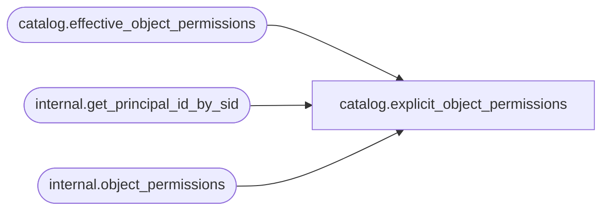

# catalog.explicit_object_permissions

**Database:** SSISDB  
**Server:** STL-SSIS-P-01  

## Architecture Diagram



## Table Dependencies

| Referenced Table |
|---|
| catalog.effective_object_permissions |
| internal.get_principal_id_by_sid |
| internal.object_permissions |

## View Code

```sql
CREATE VIEW [catalog].[explicit_object_permissions]
AS
SELECT     op.[object_type],
           op.[object_id],
           [internal].[get_principal_id_by_sid](op.[sid]) as [principal_id],
           op.[permission_type],
           op.[is_deny],
           [internal].[get_principal_id_by_sid](op.[grantor_sid]) as [grantor_id]
FROM       [internal].[object_permissions] op 
           INNER JOIN [catalog].[effective_object_permissions] eop
           ON  op.[object_type] = eop.[object_type] 
           AND op.[object_id] = eop.[object_id]
           AND eop.[permission_type] = 1

UNION

SELECT     op.[object_type],
           op.[object_id],
           [internal].[get_principal_id_by_sid](op.[sid]) as [principal_id],
           op.[permission_type],
           op.[is_deny],
           [internal].[get_principal_id_by_sid](op.[grantor_sid]) as [grantor_id]
FROM       [internal].[object_permissions] op
WHERE      IS_MEMBER('ssis_admin') = 1
           OR IS_SRVROLEMEMBER('sysadmin') = 1
```

