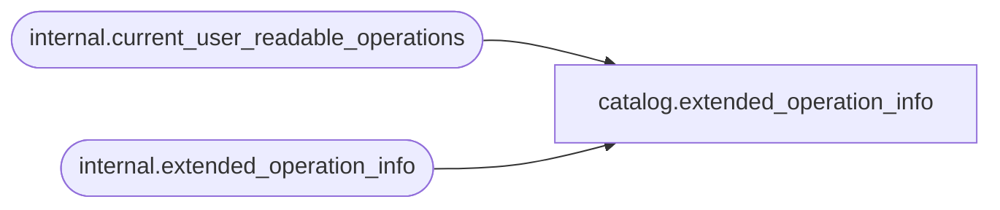

# catalog.extended_operation_info

**Database:** SSISDB  
**Server:** STL-SSIS-P-01  

## Architecture Diagram



## Table Dependencies

| Referenced Table |
|---|
| internal.current_user_readable_operations |
| internal.extended_operation_info |

## View Code

```sql
CREATE VIEW [catalog].[extended_operation_info]
AS
SELECT     [info_id], 
           [operation_id], 
           [object_name], 
           [object_type],
           [reference_id],
           [status], 
           [start_time], 
           [end_time]
FROM       [internal].[extended_operation_info]
WHERE      [operation_id] in (SELECT [id] FROM [internal].[current_user_readable_operations])
           OR (IS_MEMBER('ssis_admin') = 1)
           OR (IS_SRVROLEMEMBER('sysadmin') = 1)
           OR (IS_MEMBER('ssis_logreader') = 1)
```

