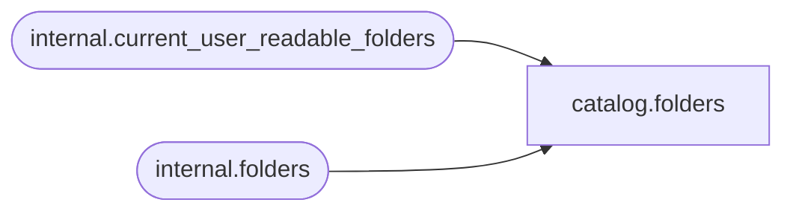

# catalog.folders

**Database:** SSISDB  
**Server:** STL-SSIS-P-01  

## Architecture Diagram



## Table Dependencies

| Referenced Table |
|---|
| internal.current_user_readable_folders |
| internal.folders |

## View Code

```sql
CREATE VIEW [catalog].[folders]
AS
SELECT     [folder_id], 
           [name], 
           [description], 
           [created_by_sid], 
           [created_by_name], 
           [created_time]
FROM       [internal].[folders]
WHERE      [folder_id] in (SELECT [id] FROM [internal].[current_user_readable_folders])
           OR (IS_MEMBER('ssis_admin') = 1)
           OR (IS_SRVROLEMEMBER('sysadmin') = 1)
```

