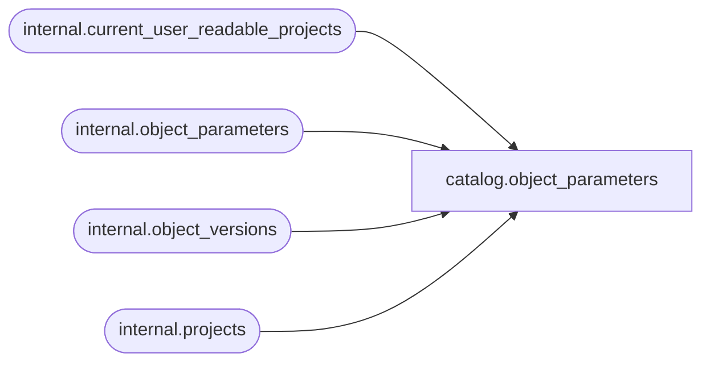

# catalog.object_parameters

**Database:** SSISDB  
**Server:** STL-SSIS-P-01  

## Architecture Diagram



## Table Dependencies

| Referenced Table |
|---|
| internal.current_user_readable_projects |
| internal.object_parameters |
| internal.object_versions |
| internal.projects |

## View Code

```sql
CREATE VIEW [catalog].[object_parameters]
AS
SELECT     params.[parameter_id], 
           params.[project_id], 
           params.[object_type], 
           params.[object_name],
           params.[parameter_name],  
           params.[parameter_data_type] AS [data_type],  
           params.[required],
           params.[sensitive],  
           params.[description],
           params.[design_default_value], 
           params.[default_value], 
           params.[value_type], 
           params.[value_set],
           params.[referenced_variable_name], 
           params.[validation_status], 
           params.[last_validation_time] 
            
FROM       [internal].[object_parameters] params INNER JOIN 
           [internal].[projects] proj ON (params.[project_version_lsn] = proj.[object_version_lsn] 
           AND params.[project_id] = proj.[project_id]) INNER JOIN
           [internal].[object_versions] ver ON (ver.[object_type] = 20 
           AND ver.[object_id] = proj.[project_id] 
           AND ver.[object_version_lsn] = proj.[object_version_lsn]) 
WHERE      params.[project_id] in (SELECT [id] FROM [internal].[current_user_readable_projects])
           OR (IS_MEMBER('ssis_admin') = 1)
           OR (IS_SRVROLEMEMBER('sysadmin') = 1)
```

