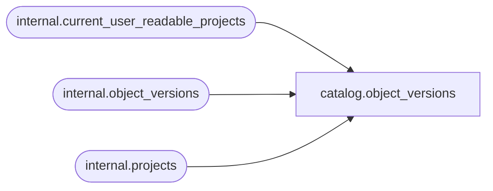

# catalog.object_versions

**Database:** SSISDB  
**Server:** STL-SSIS-P-01  

## Architecture Diagram



## Table Dependencies

| Referenced Table |
|---|
| internal.current_user_readable_projects |
| internal.object_versions |
| internal.projects |

## View Code

```sql
CREATE VIEW [catalog].[object_versions]
AS
SELECT     vers.[object_version_lsn], 
           vers.[object_id], 
           vers.[object_type], 
           projs.[name] AS [object_name],  
           vers.[description],
           vers.[created_by], 
           vers.[created_time], 
           vers.[restored_by], 
           vers.[last_restored_time]
FROM       [internal].[object_versions] vers INNER JOIN [internal].[projects] projs ON
           vers.[object_id] = projs.[project_id] AND vers.[object_type] = 20
WHERE      vers.[object_id] in (SELECT [id] FROM [internal].[current_user_readable_projects])
           OR (IS_MEMBER('ssis_admin') = 1)
           OR (IS_SRVROLEMEMBER('sysadmin') = 1)
```

