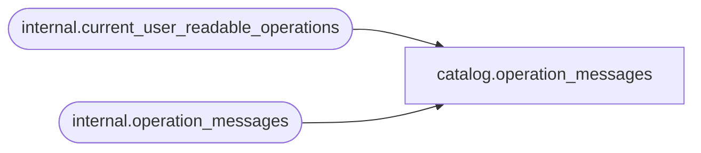

# catalog.operation_messages

**Database:** SSISDB  
**Server:** STL-SSIS-P-01  

## Architecture Diagram



## Table Dependencies

| Referenced Table |
|---|
| internal.current_user_readable_operations |
| internal.operation_messages |

## View Code

```sql
CREATE VIEW [catalog].[operation_messages]
AS
SELECT     [operation_message_id], 
           [operation_id], 
           [message_time],
           [message_type],  
           [message_source_type], 
           [message], 
           [extended_info_id]
FROM       [internal].[operation_messages] 
WHERE      [operation_id] in (SELECT [id] FROM [internal].[current_user_readable_operations])
           OR (IS_MEMBER('ssis_admin') = 1)
           OR (IS_SRVROLEMEMBER('sysadmin') = 1)
           OR (IS_MEMBER('ssis_logreader') = 1)
```

