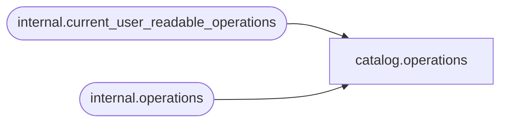

# catalog.operations

**Database:** SSISDB  
**Server:** STL-SSIS-P-01  

## Architecture Diagram



## Table Dependencies

| Referenced Table |
|---|
| internal.current_user_readable_operations |
| internal.operations |

## View Code

```sql
CREATE VIEW [catalog].[operations]
AS
SELECT     [operation_id], 
           [operation_type], 
           [created_time],
           [object_type],
           [object_id],
           [object_name],
           [status], 
           [start_time], 
           [end_time], 
           [caller_sid], 
           [caller_name], 
           [process_id],
           [stopped_by_sid],
           [stopped_by_name],
           [server_name],
           [machine_name]
FROM       internal.[operations]
WHERE      [operation_id] in (SELECT [id] FROM [internal].[current_user_readable_operations])
           OR (IS_MEMBER('ssis_admin') = 1)
           OR (IS_SRVROLEMEMBER('sysadmin') = 1)
           OR (IS_MEMBER('ssis_logreader') = 1)
```

