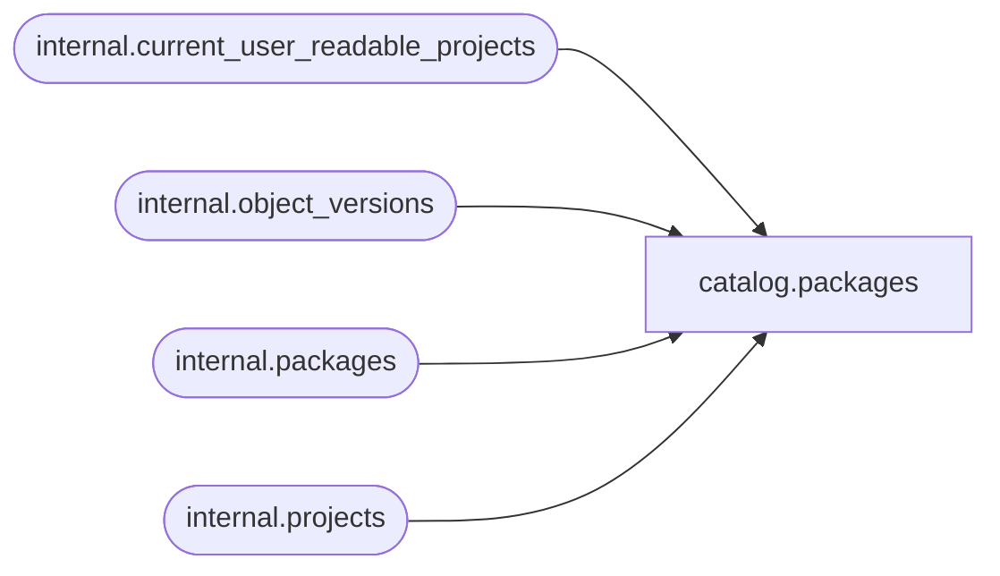

# catalog.packages

**Database:** SSISDB  
**Server:** STL-SSIS-P-01  

## Architecture Diagram



## Table Dependencies

| Referenced Table |
|---|
| internal.current_user_readable_projects |
| internal.object_versions |
| internal.packages |
| internal.projects |

## View Code

```sql
CREATE VIEW [catalog].[packages]
AS
SELECT     pkgs.[package_id], 
           pkgs.[name], 
           pkgs.[package_guid], 
           pkgs.[description],
           pkgs.[package_format_version], 
           pkgs.[version_major],  
           pkgs.[version_minor], 
           pkgs.[version_build], 
           pkgs.[version_comments], 
           pkgs.[version_guid], 
           pkgs.[project_id],
           pkgs.[entry_point],
           pkgs.[validation_status],
           pkgs.[last_validation_time]
FROM       [internal].[packages] pkgs INNER JOIN [internal].[projects] proj ON 
           (pkgs.[project_version_lsn] = proj.[object_version_lsn] 
           AND pkgs.[project_id] = proj.[project_id]) INNER JOIN
           [internal].[object_versions] vers ON ( vers.[object_type] =20 AND
           vers.[object_id] = proj.[project_id] 
           AND vers.[object_version_lsn] = proj.[object_version_lsn])
           
WHERE      pkgs.[project_id] in (SELECT [id] FROM [internal].[current_user_readable_projects])
           OR (IS_MEMBER('ssis_admin') = 1)
           OR (IS_SRVROLEMEMBER('sysadmin') = 1)
           OR (IS_MEMBER('ssis_logreader') = 1)
```

