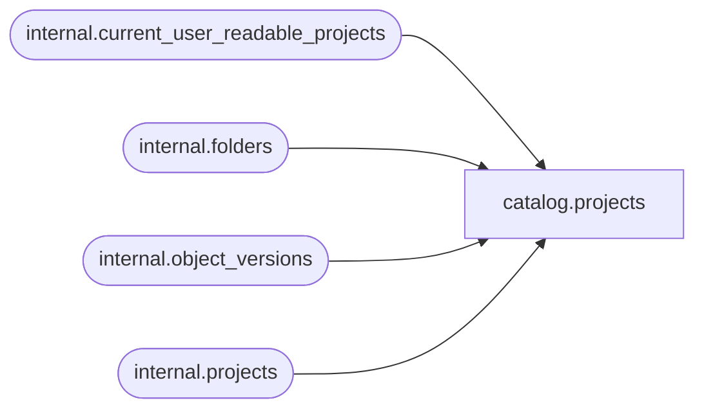

# catalog.projects

**Database:** SSISDB  
**Server:** STL-SSIS-P-01  

## Architecture Diagram



## Table Dependencies

| Referenced Table |
|---|
| internal.current_user_readable_projects |
| internal.folders |
| internal.object_versions |
| internal.projects |

## View Code

```sql
CREATE VIEW [catalog].[projects]
AS
SELECT     proj.[project_id],
           [internal].[folders].[folder_id],
           proj.[name],
           proj.[description],
           proj.[project_format_version], 
           proj.[deployed_by_sid], 
           proj.[deployed_by_name], 
           proj.[last_deployed_time], 
           proj.[created_time],
           proj.[object_version_lsn],  
           proj.[validation_status], 
           proj.[last_validation_time]
                             
FROM       [internal].[object_versions] ver INNER JOIN
           [internal].[projects] proj ON (ver.[object_id] = proj.[project_id]
           AND ver.[object_version_lsn] = proj.[object_version_lsn]) INNER JOIN
           [internal].[folders] ON proj.[folder_id] = [internal].[folders].[folder_id]
WHERE      (ver.[object_status] = 'C') 
           AND (ver.[object_type]= 20) 
           AND (
                  proj.[project_id] in (SELECT [id] FROM [internal].[current_user_readable_projects])
                  OR (IS_MEMBER('ssis_admin') = 1)
                  OR (IS_SRVROLEMEMBER('sysadmin') = 1)
                  OR (IS_MEMBER('ssis_logreader') = 1)
                )
```

