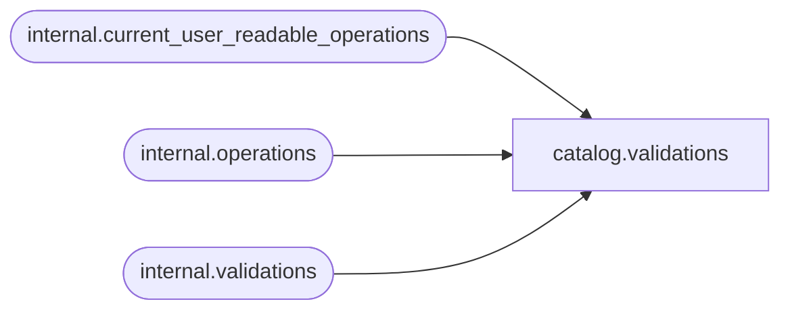

# catalog.validations

**Database:** SSISDB  
**Server:** STL-SSIS-P-01  

## Architecture Diagram



## Table Dependencies

| Referenced Table |
|---|
| internal.current_user_readable_operations |
| internal.operations |
| internal.validations |

## View Code

```sql
CREATE VIEW [catalog].[validations]
AS
SELECT     vals.[validation_id], 
           vals.[environment_scope], 
           vals.[validate_type],
           vals.[folder_name],
           vals.[project_name],         
           vals.[project_lsn],
           vals.[use32bitruntime],
           vals.[reference_id], 
           opers.[operation_type],
           opers.[object_name],  
           opers.[object_type], 
           opers.[object_id], 
           opers.[start_time], 
           opers.[end_time], 
           opers.[status], 
           opers.[caller_sid], 
           opers.[caller_name], 
           opers.[process_id],
           opers.[stopped_by_sid], 
           opers.[stopped_by_name],
           opers.[operation_guid] as [dump_id],
           opers.[server_name],
           opers.[machine_name]
FROM       [internal].[validations] vals INNER JOIN [internal].[operations] opers 
           ON vals.[validation_id] = opers.[operation_id]
WHERE      opers.[operation_id] in (SELECT [id] FROM [internal].[current_user_readable_operations])
           OR (IS_MEMBER('ssis_admin') = 1)
           OR (IS_SRVROLEMEMBER('sysadmin') = 1)
           OR (IS_MEMBER('ssis_logreader') = 1)
```

