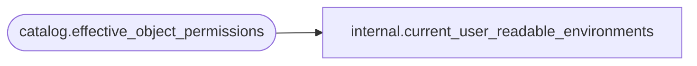

# internal.current_user_readable_environments

**Database:** SSISDB  
**Server:** STL-SSIS-P-01  

## Architecture Diagram



## Table Dependencies

| Referenced Table |
|---|
| catalog.effective_object_permissions |

## View Code

```sql
CREATE VIEW [internal].[current_user_readable_environments]
AS
SELECT     [object_id] AS [ID]
FROM       [catalog].[effective_object_permissions]
WHERE      [object_type] = 3
           AND  [permission_type] = 1
```

