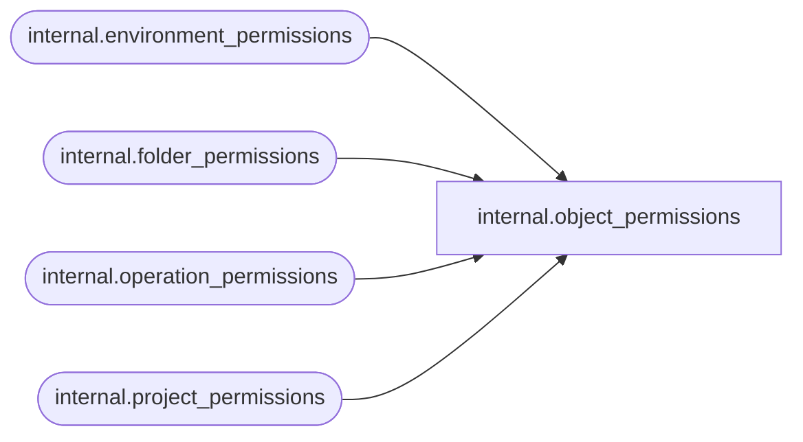

# internal.object_permissions

**Database:** SSISDB  
**Server:** STL-SSIS-P-01  

## Architecture Diagram



## Table Dependencies

| Referenced Table |
|---|
| internal.environment_permissions |
| internal.folder_permissions |
| internal.operation_permissions |
| internal.project_permissions |

## View Code

```sql
create view [internal].[object_permissions]
AS
SELECT     CAST(1 AS SmallInt) AS [object_type], 
           [object_id], 
           [sid],
           [permission_type],
           [is_role],
           [is_deny],
           [grantor_sid]
FROM       [internal].[folder_permissions]
UNION ALL
SELECT     CAST(2 AS SmallInt) AS [object_type], 
           [object_id], 
           [sid],
           [permission_type],
           [is_role],
           [is_deny],
           [grantor_sid]
FROM       [internal].[project_permissions]
UNION ALL
SELECT     CAST(3 AS SmallInt) AS [object_type], 
           [object_id],
           [sid],
           [permission_type],
           [is_role],
           [is_deny],
           [grantor_sid]
FROM       [internal].[environment_permissions]
UNION ALL
SELECT     CAST(4 AS SmallInt) AS [object_type], 
           [object_id], 
           [sid],
           [permission_type],
           [is_role],
           [is_deny],
           [grantor_sid]
FROM       [internal].[operation_permissions]
```

