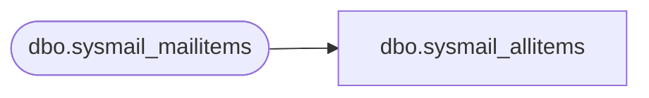

# dbo.sysmail_allitems

**Database:** msdb  
**Server:** STL-SSIS-P-01  

## Architecture Diagram



## Table Dependencies

| Referenced Table |
|---|
| dbo.sysmail_mailitems |

## View Code

```sql
CREATE VIEW sysmail_allitems
AS
SELECT mailitem_id,
       profile_id,
       recipients,
       copy_recipients,
       blind_copy_recipients,
       subject,
       body,
       body_format,
       importance,
       sensitivity,
       file_attachments,
       attachment_encoding,
       query,
       execute_query_database,
       attach_query_result_as_file,
       query_result_header,
       query_result_width,
       query_result_separator,
       exclude_query_output,
       append_query_error,
       send_request_date,
       send_request_user,
       sent_account_id,
       CASE sent_status 
          WHEN 0 THEN 'unsent' 
          WHEN 1 THEN 'sent' 
          WHEN 3 THEN 'retrying' 
          ELSE 'failed' 
       END as sent_status,
       sent_date,
       last_mod_date,
       last_mod_user
FROM msdb.dbo.sysmail_mailitems
WHERE (send_request_user = SUSER_SNAME()) OR (ISNULL(IS_SRVROLEMEMBER(N'sysadmin'), 0) = 1)
```

