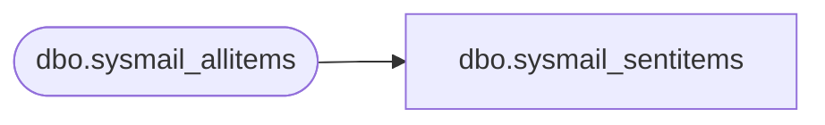

# dbo.sysmail_sentitems

**Database:** msdb  
**Server:** STL-SSIS-P-01  

## Architecture Diagram



## Table Dependencies

| Referenced Table |
|---|
| dbo.sysmail_allitems |

## View Code

```sql
CREATE VIEW sysmail_sentitems
AS
SELECT * FROM msdb.dbo.sysmail_allitems WHERE sent_status = 'sent'
```

