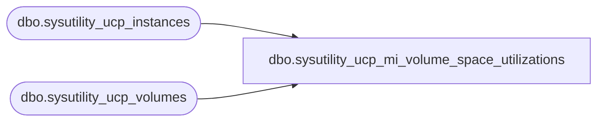

# dbo.sysutility_ucp_mi_volume_space_utilizations

**Database:** msdb  
**Server:** STL-SSIS-P-01  

## Architecture Diagram



## Table Dependencies

| Referenced Table |
|---|
| dbo.sysutility_ucp_instances |
| dbo.sysutility_ucp_volumes |

## View Code

```sql
CREATE VIEW [dbo].[sysutility_ucp_mi_volume_space_utilizations] AS(
-- TODO VSTS 280036(rnagpal) : Temporarily Keeping under_utilization to 10 and over_utilization to 70 for now
-- since we might reintroduce them in near future which will not require any interface change for the 
-- Utility object model / UI. Presently, we are not exposing under and over utilization thresholds in UI
-- so they are not exposed. If that remains the same till KJ CTP2, i'll remove them.
SELECT	vol.physical_server_name AS physical_server_name, 
		svr.Name as server_instance_name,
		vol.volume_name AS volume_name, 
		vol.volume_device_id AS volume_device_id, 
		vol.total_space_utilization AS current_utilization, 
		vol.total_space_used AS used_space,
		vol.total_space AS available_space,
		10 AS under_utilization, 
		70 AS over_utilization
FROM	msdb.dbo.sysutility_ucp_volumes AS vol,
		msdb.dbo.sysutility_ucp_instances AS svr
WHERE	vol.physical_server_name = svr.ComputerNamePhysicalNetBIOS)

dbo,sysutility_ucp_policies,CREATE VIEW dbo.sysutility_ucp_policies 
AS
SELECT
    rhp.health_policy_id AS health_policy_id,
    p.policy_id AS policy_id,
    rhp.policy_name AS policy_name,
    rhp.rollup_object_type AS rollup_object_type,
    rhp.rollup_object_urn AS rollup_object_urn,
    rhp.target_type AS target_type,
    rhp.resource_type AS resource_type,
    rhp.utilization_type AS utilization_type,
    rhp.utilization_threshold AS utilization_threshold,
    rhp.is_global_policy AS is_global_policy
FROM [msdb].[dbo].[sysutility_ucp_health_policies_internal] rhp
INNER JOIN msdb.dbo.syspolicy_policies p ON p.name = rhp.policy_name

dbo,sysutility_ucp_policy_check_conditions,CREATE VIEW dbo.sysutility_ucp_policy_check_conditions 
AS
SELECT
    cc.target_type AS target_type,
    cc.resource_type AS resource_type,
    cc.utilization_type AS utilization_type,
    cc.facet_name AS facet_name,
    cc.attribute_name AS attribute_name,
    cc.operator_type AS operator_type,
    cc.property_name AS property_name
FROM msdb.[dbo].[sysutility_ucp_policy_check_conditions_internal] cc

dbo,sysutility_ucp_policy_configuration,CREATE VIEW dbo.sysutility_ucp_policy_configuration AS
(    
    SELECT 1 AS utilization_type
        , CAST(UnderUtilizationOccurenceFrequency AS INT) AS occurence_frequency
        , CAST(UnderUtilizationTrailingWindow AS INT) AS trailing_window
    FROM (SELECT name, current_value FROM msdb.dbo.sysutility_ucp_configuration) config
        PIVOT (MAX(current_value) FOR name IN (UnderUtilizationOccurenceFrequency, UnderUtilizationTrailingWindow)) pvt

    UNION ALL

    SELECT 2 AS utilization_type
        , CAST(OverUtilizationOccurenceFrequency AS INT) AS occurence_frequency
        , CAST(OverUtilizationTrailingWindow AS INT) AS trailing_window
    FROM (SELECT name, current_value FROM msdb.dbo.sysutility_ucp_configuration) config
        PIVOT (MAX(current_value) FOR name IN (OverUtilizationOccurenceFrequency, OverUtilizationTrailingWindow)) pvt
) 

dbo,sysutility_ucp_policy_target_conditions,CREATE VIEW dbo.sysutility_ucp_policy_target_conditions 
AS
SELECT
    tc.rollup_object_type AS rollup_object_type,
    tc.target_type AS target_type,
    tc.resource_type AS resource_type,
    tc.utilization_type AS utilization_type, 
    tc.facet_name AS facet_name,
    tc.attribute_name AS attribute_name,
    tc.operator_type as operator_type,
    tc.property_name as property_name
FROM msdb.[dbo].[sysutility_ucp_policy_target_conditions_internal] tc
```

