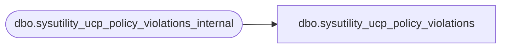

# dbo.sysutility_ucp_policy_violations

**Database:** msdb  
**Server:** STL-SSIS-P-01  

## Architecture Diagram



## Table Dependencies

| Referenced Table |
|---|
| dbo.sysutility_ucp_policy_violations_internal |

## View Code

```sql
CREATE VIEW dbo.sysutility_ucp_policy_violations 
AS
    SELECT pv.health_policy_id
        , pv.policy_id
        , pv.policy_name
        , pv.history_id
        , pv.detail_id
        , pv.target_query_expression
        , pv.target_query_expression_with_id
        , pv.execution_date
        , pv.result
    FROM dbo.sysutility_ucp_policy_violations_internal pv

dbo,sysutility_ucp_utility_space_utilization,---
--- Gets the total utility space utilization. 
--- The funny left-outer-join is to account for cases where there is no "utility-wide" entry yet 
--- typically, right at bootstrap time
---
CREATE VIEW dbo.sysutility_ucp_utility_space_utilization
AS
   SELECT ISNULL(S2.total_space_bytes, 0) AS total_utility_storage,
          ISNULL(S2.used_space_bytes, 0) AS total_utilized_space 	
   FROM (SELECT 1 AS x) AS S1
         LEFT OUTER JOIN 
        (SELECT total_space_bytes, used_space_bytes 
          FROM dbo.syn_sysutility_ucp_space_utilization
          WHERE object_type = 0 AND -- utility-wide information
                aggregation_type = 0 AND -- detail-information
                processing_time = (SELECT latest_processing_time FROM msdb.dbo.sysutility_ucp_processing_state_internal)
        ) AS S2 ON (1=1)
```

