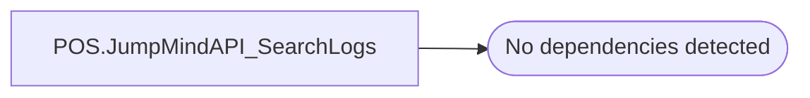

# POS.JumpMindAPI_SearchLogs

**Database:** ApplicationResources  
**Server:** bearcluster01  

## Architecture Diagram



## Table Dependencies

_No table references detected._

## Stored Procedure Code

```sql
-- =============================================
-- Author:		Hickey, Brandon
-- Create date: 5/10/2023
-- Description:	Used to pull logs from the JumpMind transaction table
-- =============================================
CREATE PROCEDURE [POS].[JumpMindAPI_SearchLogs] 
	-- Add the parameters for the stored procedure here
	@storeNo varchar(5),
	@registerNo varchar(5),
	@transactionNo varchar(10),
	@startDate DateTime,
	@endDate DateTime,
	@dateType varchar(10),
	@transactionType varchar(20)
AS
BEGIN
	DECLARE @sql nvarchar(max);
	SET @sql = 'SELECT * 
	FROM [POS].[JumpMindAPI_Logging] 
	WHERE 1=1 ';
	
	IF @storeNo IS NOT NULL
		SET @sql = @sql + 'AND storeNo = @storeNo ';
	IF @registerNo IS NOT NULL
		SET @sql = @sql + 'AND registerNo = @registerNo ';
	IF @transactionNo IS NOT NULL
		SET @sql = @sql + 'AND transactionNo = @transactionNo ';
	IF @dateType = 'JSON' 
		SET @sql = @sql + 'AND jsonDateTime >= @startDate AND jsonDateTime <= @endDate ';
	IF @dateType = 'API' 
		SET @sql = @sql + 'AND apiDateTime >= @startDate AND apiDateTime <= @endDate ';
	IF @transactionType IS NOT NULL
		SET @sql = @sql + 'transactionType = @transactionType ';
	SET @sql = @sql + 'ORDER BY jsonDateTime ASC';

	EXEC sp_executesql @sql, N'@storeNo varchar(5)
	,@registerNo varchar(5)
	,@transactionNo varchar(10)
	,@startDate DateTime
	,@endDate DateTime
	,@dateType varchar(10)
	,@transactionType varchar(20)'
	,@storeNo
	,@registerNo
	,@transactionNo
	,@startDate
	,@endDate
	,@dateType
	,@transactionType;

	
END
```

