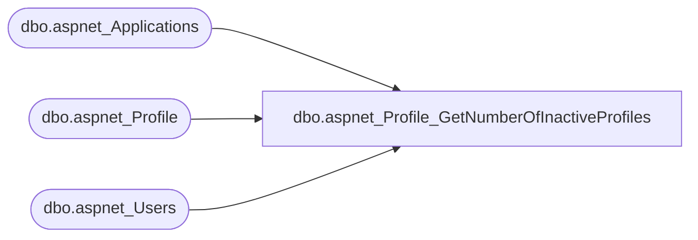

# dbo.aspnet_Profile_GetNumberOfInactiveProfiles

**Database:** ApplicationResources  
**Server:** bearcluster01  

## Architecture Diagram



## Table Dependencies

| Referenced Table |
|---|
| dbo.aspnet_Applications |
| dbo.aspnet_Profile |
| dbo.aspnet_Users |

## Stored Procedure Code

```sql
CREATE PROCEDURE dbo.aspnet_Profile_GetNumberOfInactiveProfiles
    @ApplicationName        nvarchar(256),
    @ProfileAuthOptions     int,
    @InactiveSinceDate      datetime
AS
BEGIN
    DECLARE @ApplicationId uniqueidentifier
    SELECT  @ApplicationId = NULL
    SELECT  @ApplicationId = ApplicationId FROM aspnet_Applications WHERE LOWER(@ApplicationName) = LoweredApplicationName
    IF (@ApplicationId IS NULL)
    BEGIN
        SELECT 0
        RETURN
    END

    SELECT  COUNT(*)
    FROM    dbo.aspnet_Users u, dbo.aspnet_Profile p
    WHERE   ApplicationId = @ApplicationId
        AND u.UserId = p.UserId
        AND (LastActivityDate <= @InactiveSinceDate)
        AND (
                (@ProfileAuthOptions = 2)
                OR (@ProfileAuthOptions = 0 AND IsAnonymous = 1)
                OR (@ProfileAuthOptions = 1 AND IsAnonymous = 0)
            )
END
```

