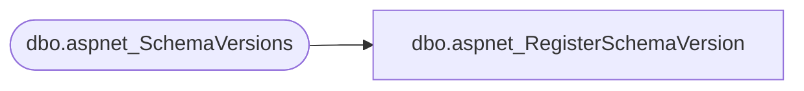

# dbo.aspnet_RegisterSchemaVersion

**Database:** ApplicationResources  
**Server:** bearcluster01  

## Architecture Diagram



## Table Dependencies

| Referenced Table |
|---|
| dbo.aspnet_SchemaVersions |

## Stored Procedure Code

```sql
CREATE PROCEDURE [dbo].aspnet_RegisterSchemaVersion
    @Feature                   nvarchar(128),
    @CompatibleSchemaVersion   nvarchar(128),
    @IsCurrentVersion          bit,
    @RemoveIncompatibleSchema  bit
AS
BEGIN
    IF( @RemoveIncompatibleSchema = 1 )
    BEGIN
        DELETE FROM dbo.aspnet_SchemaVersions WHERE Feature = LOWER( @Feature )
    END
    ELSE
    BEGIN
        IF( @IsCurrentVersion = 1 )
        BEGIN
            UPDATE dbo.aspnet_SchemaVersions
            SET IsCurrentVersion = 0
            WHERE Feature = LOWER( @Feature )
        END
    END

    INSERT  dbo.aspnet_SchemaVersions( Feature, CompatibleSchemaVersion, IsCurrentVersion )
    VALUES( LOWER( @Feature ), @CompatibleSchemaVersion, @IsCurrentVersion )
END
dbo,aspnet_Roles_CreateRole,CREATE PROCEDURE dbo.aspnet_Roles_CreateRole
    @ApplicationName  nvarchar(256),
    @RoleName         nvarchar(256)
AS
BEGIN
    DECLARE @ApplicationId uniqueidentifier
    SELECT  @ApplicationId = NULL

    DECLARE @ErrorCode     int
    SET @ErrorCode = 0

    DECLARE @TranStarted   bit
    SET @TranStarted = 0

    IF( @@TRANCOUNT = 0 )
    BEGIN
        BEGIN TRANSACTION
        SET @TranStarted = 1
    END
    ELSE
        SET @TranStarted = 0

    EXEC dbo.aspnet_Applications_CreateApplication @ApplicationName, @ApplicationId OUTPUT

    IF( @@ERROR <> 0 )
    BEGIN
        SET @ErrorCode = -1
        GOTO Cleanup
    END

    IF (EXISTS(SELECT RoleId FROM dbo.aspnet_Roles WHERE LoweredRoleName = LOWER(@RoleName) AND ApplicationId = @ApplicationId))
    BEGIN
        SET @ErrorCode = 1
        GOTO Cleanup
    END

    INSERT INTO dbo.aspnet_Roles
                (ApplicationId, RoleName, LoweredRoleName)
         VALUES (@ApplicationId, @RoleName, LOWER(@RoleName))

    IF( @@ERROR <> 0 )
    BEGIN
        SET @ErrorCode = -1
        GOTO Cleanup
    END

    IF( @TranStarted = 1 )
    BEGIN
        SET @TranStarted = 0
        COMMIT TRANSACTION
    END

    RETURN(0)

Cleanup:

    IF( @TranStarted = 1 )
    BEGIN
        SET @TranStarted = 0
        ROLLBACK TRANSACTION
    END

    RETURN @ErrorCode

END
```

