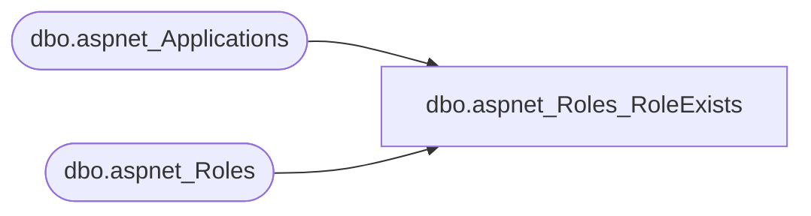

# dbo.aspnet_Roles_RoleExists

**Database:** ApplicationResources  
**Server:** bearcluster01  

## Architecture Diagram



## Table Dependencies

| Referenced Table |
|---|
| dbo.aspnet_Applications |
| dbo.aspnet_Roles |

## Stored Procedure Code

```sql
CREATE PROCEDURE dbo.aspnet_Roles_RoleExists
    @ApplicationName  nvarchar(256),
    @RoleName         nvarchar(256)
AS
BEGIN
    DECLARE @ApplicationId uniqueidentifier
    SELECT  @ApplicationId = NULL
    SELECT  @ApplicationId = ApplicationId FROM aspnet_Applications WHERE LOWER(@ApplicationName) = LoweredApplicationName
    IF (@ApplicationId IS NULL)
        RETURN(0)
    IF (EXISTS (SELECT RoleName FROM dbo.aspnet_Roles WHERE LOWER(@RoleName) = LoweredRoleName AND ApplicationId = @ApplicationId ))
        RETURN(1)
    ELSE
        RETURN(0)
END
```

