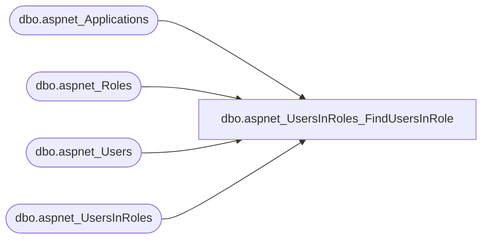

# dbo.aspnet_UsersInRoles_FindUsersInRole

**Database:** ApplicationResources  
**Server:** bearcluster01  

## Architecture Diagram



## Table Dependencies

| Referenced Table |
|---|
| dbo.aspnet_Applications |
| dbo.aspnet_Roles |
| dbo.aspnet_Users |
| dbo.aspnet_UsersInRoles |

## Stored Procedure Code

```sql
CREATE PROCEDURE dbo.aspnet_UsersInRoles_FindUsersInRole
    @ApplicationName  nvarchar(256),
    @RoleName         nvarchar(256),
    @UserNameToMatch  nvarchar(256)
AS
BEGIN
    DECLARE @ApplicationId uniqueidentifier
    SELECT  @ApplicationId = NULL
    SELECT  @ApplicationId = ApplicationId FROM aspnet_Applications WHERE LOWER(@ApplicationName) = LoweredApplicationName
    IF (@ApplicationId IS NULL)
        RETURN(1)
     DECLARE @RoleId uniqueidentifier
     SELECT  @RoleId = NULL

     SELECT  @RoleId = RoleId
     FROM    dbo.aspnet_Roles
     WHERE   LOWER(@RoleName) = LoweredRoleName AND ApplicationId = @ApplicationId

     IF (@RoleId IS NULL)
         RETURN(1)

    SELECT u.UserName
    FROM   dbo.aspnet_Users u, dbo.aspnet_UsersInRoles ur
    WHERE  u.UserId = ur.UserId AND @RoleId = ur.RoleId AND u.ApplicationId = @ApplicationId AND LoweredUserName LIKE LOWER(@UserNameToMatch)
    ORDER BY u.UserName
    RETURN(0)
END
```

