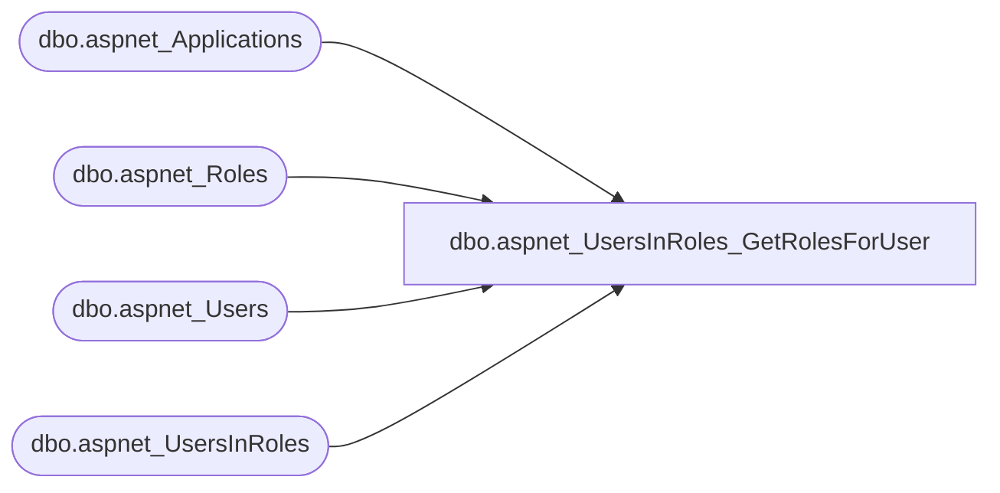

# dbo.aspnet_UsersInRoles_GetRolesForUser

**Database:** ApplicationResources  
**Server:** bearcluster01  

## Architecture Diagram



## Table Dependencies

| Referenced Table |
|---|
| dbo.aspnet_Applications |
| dbo.aspnet_Roles |
| dbo.aspnet_Users |
| dbo.aspnet_UsersInRoles |

## Stored Procedure Code

```sql
CREATE PROCEDURE dbo.aspnet_UsersInRoles_GetRolesForUser
    @ApplicationName  nvarchar(256),
    @UserName         nvarchar(256)
AS
BEGIN
    DECLARE @ApplicationId uniqueidentifier
    SELECT  @ApplicationId = NULL
    SELECT  @ApplicationId = ApplicationId FROM aspnet_Applications WHERE LOWER(@ApplicationName) = LoweredApplicationName
    IF (@ApplicationId IS NULL)
        RETURN(1)
    DECLARE @UserId uniqueidentifier
    SELECT  @UserId = NULL

    SELECT  @UserId = UserId
    FROM    dbo.aspnet_Users
    WHERE   LoweredUserName = LOWER(@UserName) AND ApplicationId = @ApplicationId

    IF (@UserId IS NULL)
        RETURN(1)

    SELECT r.RoleName
    FROM   dbo.aspnet_Roles r, dbo.aspnet_UsersInRoles ur
    WHERE  r.RoleId = ur.RoleId AND r.ApplicationId = @ApplicationId AND ur.UserId = @UserId
    ORDER BY r.RoleName
    RETURN (0)
END
```

